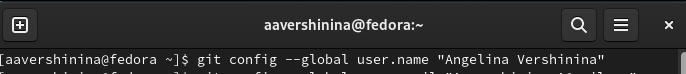
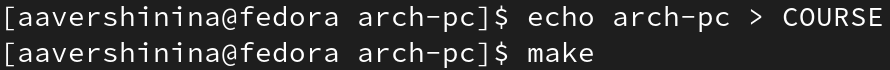

---
## Front matter
title: "Лабораторная работа №3"
subtitle: "Дисциплина: Архитектура компьютеров"
author: "Вершинина Ангелина Алексеевна"
id number: "1132221891"
group: "НПИбд-01-22"

## Generic otions
lang: ru-RU
toc-title: "Содержание"

## Bibliography
bibliography: bib/cite.bib
csl: pandoc/csl/gost-r-7-0-5-2008-numeric.csl

## Pdf output format
toc: true # Table of contents
toc-depth: 2
lof: true # List of figures
lot: true # List of tables
fontsize: 12pt
linestretch: 1.5
papersize: a4
documentclass: scrreprt
## I18n polyglossia
polyglossia-lang:
  name: russian
  options:
	- spelling=modern
	- babelshorthands=true
polyglossia-otherlangs:
  name: english
## I18n babel
babel-lang: russian
babel-otherlangs: english
## Fonts
mainfont: PT Serif
romanfont: PT Serif
sansfont: PT Sans
monofont: PT Mono
mainfontoptions: Ligatures=TeX
romanfontoptions: Ligatures=TeX
sansfontoptions: Ligatures=TeX,Scale=MatchLowercase
monofontoptions: Scale=MatchLowercase,Scale=0.9
## Biblatex
biblatex: true
biblio-style: "gost-numeric"
biblatexoptions:
  - parentracker=true
  - backend=biber
  - hyperref=auto
  - language=auto
  - autolang=other*
  - citestyle=gost-numeric
## Pandoc-crossref LaTeX customization
figureTitle: "Рис."
tableTitle: "Таблица"
listingTitle: "Листинг"
lofTitle: "Список иллюстраций"
lotTitle: "Список таблиц"
lolTitle: "Листинги"
## Misc options
indent: true
header-includes:
  - \usepackage{indentfirst}
  - \usepackage{float} # keep figures where there are in the text
  - \floatplacement{figure}{H} # keep figures where there are in the text
---

# Цель работы

Целью данной лабораторной работы является изучение идеологии и применение средств
контроля версий. А также приобретение практических навыков по работе с системой git.

# Задание

Создать репозиторий на Github и загрузить фалы отчетов лабораторных работ

# Теоретическое введение

В табл. [-@tbl:std-dir] приведено краткое описание стандартных каталогов Unix.

: Описание некоторых каталогов файловой системы GNU Linux {#tbl:std-dir}

| Имя каталога | Описание каталога                                                                                                          |
|--------------|----------------------------------------------------------------------------------------------------------------------------|
| `/`          | Корневая директория, содержащая всю файловую                                                                               |
| `/bin `      | Основные системные утилиты, необходимые как в однопользовательском режиме, так и при обычной работе всем пользователям     |
| `/etc`       | Общесистемные конфигурационные файлы и файлы конфигурации установленных программ                                           |
| `/home`      | Содержит домашние директории пользователей, которые, в свою очередь, содержат персональные настройки и данные пользователя |
| `/media`     | Точки монтирования для сменных носителей                                                                                   |
| `/root`      | Домашняя директория пользователя  `root`                                                                                   |
| `/tmp`       | Временные файлы                                                                                                            |
| `/usr`       | Вторичная иерархия для данных пользователя                                                                                 |

Более подробно об Unix см. в [@gnu-doc:bash;@newham:2005:bash;@zarrelli:2017:bash;@robbins:2013:bash;@tannenbaum:arch-pc:ru;@tannenbaum:modern-os:ru].

# Выполнение лабораторной работы

## Настройка github

Для выполнения данной лабораторной работы необходимо установить репозиторий с
возможностью бесплатного размещения данных. По методических рекомендациям буду
использовать Github.
Перехожу на сайт по адресу https://github.com/ , прохожу регистрацию и создаю учётную
запись, заполняя основные данные.(рис. [-@fig:001]) Был создан аккаунт (рис. [-@fig:002])

{ #fig:001 width=70% }

{ #fig:002 width=70% }

## Базовая настройка git

Проведу предварительную конфигурацию git. Для этого открою терминал и введу следующие
команды для указания имени и почты владельца репозитория (рис. [-@fig:003] и [-@fig:004])

{ #fig:003 width=70% }

{ #fig:004 width=70% }

Далее настрою utf-8 в выводе сообщений git. Для этого введу команду, указанную в
методических материалах. (рис. [-@fig:005])

{ #fig:005 width=70% }

Задам имя начальной ветки – master (рис. [-@fig:006])

{ #fig:006 width=70% }

Задам параметр autocrlf (рис. [-@fig:007])

{ #fig:007 width=70% }

Задам параметр safecrlf (рис. [-@fig:008])

{ #fig:008 width=70% }

## Создание SSH ключа

Для последующей идентификации пользователя на сервере репозиториев необходимо
сгенерировать пару ключей (приватный и открытый). Введу команду для генерации ключа.(рис. [-@fig:009])

{ #fig:009 width=70% }

Далее сгенерированный ключ необходимо загрузить , для этого перейду в учетную запись на
github, перейду в настройки во вкладу “SSH и GPG keys” и создам новый ключ. Скопирую
ключ из локальной консоли ключ в буфер обмена при помощи следующей команды.(рис. [-@fig:0010])

{ #fig:0010 width=70% }

Вставляю ключ в появившееся на сайте поле и указываю для ключа имя – Key1 (рис. [-@fig:0011])

{ #fig:0011 width=70% }

## Создание рабочего пространства и репозитория курса на основе шаблона

Создам рабочее пространство, для этого открою терминал и создам каталог для предмета
«Архитектура компьютера».(рис. [-@fig:0012])

{ #fig:0012 width=70% }

## Создание репозитория курса на основе шаблона

Для создания репозитория перейду в учетную запись на github. Перейду на станицу
репозитория с шаблоном курса https://github.com/yam adharma/course-directory-student-
template. Далее выбераю Use this template. В открывшемся окне задаю имя репозитория -
study_2022–2023_arh-pcи и создаю репозиторий, нажимая кнопку - Create repository from
template. (рис. [-@fig:0013])

{ #fig:0013 width=70% }

Далее открою терминал и перейду в каталог курса.(рис. [-@fig:0014])

{ #fig:0014 width=70% }

Буду клонировать созданный репозиторий. (рис. [-@fig:0015])
Ссылку для клонирования скопировала на странице созданного репозитория Code -> SSH. (рис. [-@fig:0016])

{ #fig:0015 width=70% }

{ #fig:0016 width=70% }

## Настройка каталога курса

Для последующей настройки перейду в каталог курса.(рис. [-@fig:0017])

{ #fig:0017 width=70% }

Удалю лишние файлы, используя следующую команду rm.(рис. [-@fig:0018])

{ #fig:0018 width=70% }

Создам необходимые каталоги (рис. [-@fig:0019]) и отправлю файлы их на сервер (рис. [-@fig:0020] и [-@fig:0021])

{ #fig:0019 width=70% }

{ #fig:0020 width=70% }

{ #fig:0021 width=70% }

Проверю правильность создания иерархии рабочего пространства в локальном репозитории
и на странице github. Для этого перейду с свою учетную запись и просмотрю созданные
файлы и каталоги. Все создано верно. (рис. [-@fig:0022] и [-@fig:0023])

{ #fig:0022 width=70% }

{ #fig:0023 width=70% }

# Задание для самостоятельной работы

1. После создания отчета, перенесу его в соответствующий каталог рабочего пространства
(labs>lab03>report).
2. В ОС Linux открою сайт ТУИС РУДН и перейду в свою учетную запись и скачаю отчеты
выполнения лабораторных работ под номерами 1 и 2. Добавлю отчеты в соответствующие им
каталоги. (рис. [-@fig:0024] и [-@fig:0025], [-@fig:0026] и [-@fig:0027])

{ #fig:0024 width=70% }

{ #fig:0025 width=70% }

{ #fig:0026 width=70% }

{ #fig:0027 width=70% }

# Выводы

В результате выполнения лабораторной работы я изучила идеологии и применение средств
контроля версий. А также приобрела практических навыки по работе с системой git.

