---
## Front matter
title: "Лабораторная работа №4 "
subtitle: "Дисциплина: Архитектура компьютеров"
author: "Вершинина Ангелина Алексеевна"
id number: "1132221891"
group: "НПИбд-01-22"

## Generic otions
lang: ru-RU
toc-title: "Содержание"

## Bibliography
bibliography: bib/cite.bib
csl: pandoc/csl/gost-r-7-0-5-2008-numeric.csl

## Pdf output format
toc: true # Table of contents
toc-depth: 2
lof: true # List of figures
lot: true # List of tables
fontsize: 12pt
linestretch: 1.5
papersize: a4
documentclass: scrreprt
## I18n polyglossia
polyglossia-lang:
  name: russian
  options:
	- spelling=modern
	- babelshorthands=true
polyglossia-otherlangs:
  name: english
## I18n babel
babel-lang: russian
babel-otherlangs: english
## Fonts
mainfont: PT Serif
romanfont: PT Serif
sansfont: PT Sans
monofont: PT Mono
mainfontoptions: Ligatures=TeX
romanfontoptions: Ligatures=TeX
sansfontoptions: Ligatures=TeX,Scale=MatchLowercase
monofontoptions: Scale=MatchLowercase,Scale=0.9
## Biblatex
biblatex: true
biblio-style: "gost-numeric"
biblatexoptions:
  - parentracker=true
  - backend=biber
  - hyperref=auto
  - language=auto
  - autolang=other*
  - citestyle=gost-numeric
## Pandoc-crossref LaTeX customization
figureTitle: "Рис."
tableTitle: "Таблица"
listingTitle: "Листинг"
lofTitle: "Список иллюстраций"
lotTitle: "Список таблиц"
lolTitle: "Листинги"
## Misc options
indent: true
header-includes:
  - \usepackage{indentfirst}
  - \usepackage{float} # keep figures where there are in the text
  - \floatplacement{figure}{H} # keep figures where there are in the text
---

# Цель работы

Целью работы является освоение процедуры оформления отчетов с помощью
легковесного языка разметки Markdown.

# Задание

Описание отчетов лабораторных работ при помощи языка разметки Markdown.

# Теоретическое введение

В табл. [-@tbl:std-dir] приведено краткое описание стандартных каталогов Unix.

: Описание некоторых каталогов файловой системы GNU Linux {#tbl:std-dir}

| Имя каталога | Описание каталога                                                                                                          |
|--------------|----------------------------------------------------------------------------------------------------------------------------|
| `/`          | Корневая директория, содержащая всю файловую                                                                               |
| `/bin `      | Основные системные утилиты, необходимые как в однопользовательском режиме, так и при обычной работе всем пользователям     |
| `/etc`       | Общесистемные конфигурационные файлы и файлы конфигурации установленных программ                                           |
| `/home`      | Содержит домашние директории пользователей, которые, в свою очередь, содержат персональные настройки и данные пользователя |
| `/media`     | Точки монтирования для сменных носителей                                                                                   |
| `/root`      | Домашняя директория пользователя  `root`                                                                                   |
| `/tmp`       | Временные файлы                                                                                                            |
| `/usr`       | Вторичная иерархия для данных пользователя                                                                                 |

# Выполнение лабораторной работы

Открываю терминал для дальнейшего выполнения лабораторной работы. 

Перехожу в каталог курса, сформированный при выполнении лаборатор-
ной работы №3. (рис. [-@fig:001])

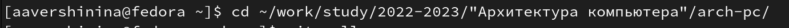{ #fig:001 width=70% }

Обновлю локальный репозиторий, скачав изменения из удаленного репози-
тория с помощью команды *git pull*.  (рис. [-@fig:002])

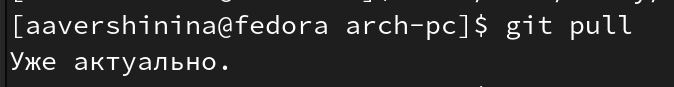{ #fig:002 width=70% }

Перейду в каталог с шаблоном отчета по лабораторной работе  №4. (рис. [-@fig:003])

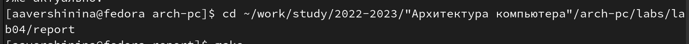{ #fig:003 width=70% }

Проведу компиляцию шаблона с использованием Makefile. Для этого
введите команду **make**. (рис. [-@fig:004])

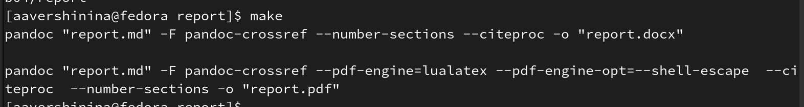{ #fig:004 width=70% }

Проверю корректность генерации файлов *report.pdf* и
*report.docx* в графическом менеджере. Все выполнено верно. (рис. [-@fig:005])

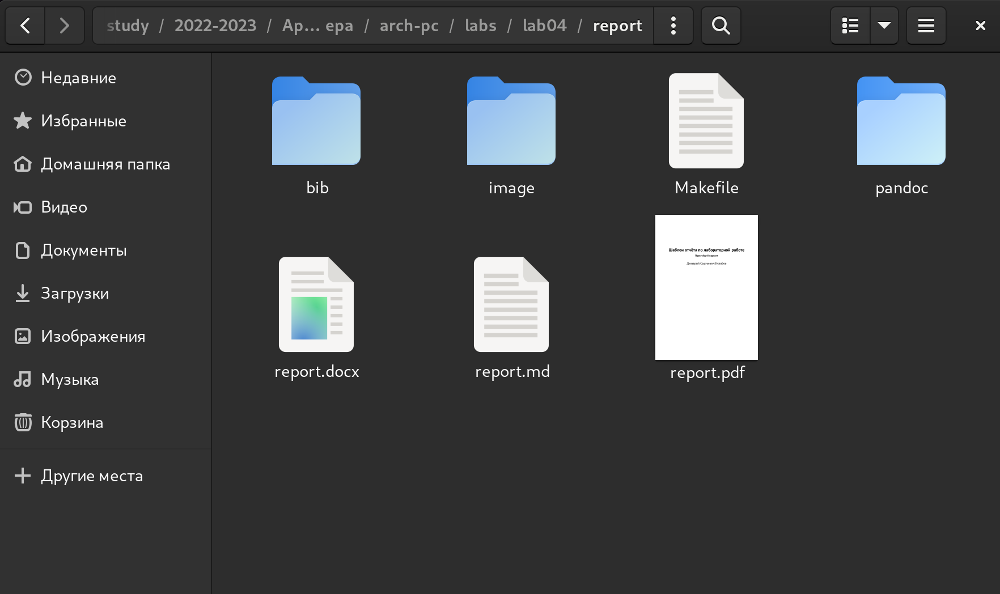{ #fig:005 width=70% }

Удалю полученные файлы с использованием Makefile. Для этого введу
команду **make clean**. (рис. [-@fig:006])

{ #fig:006 width=70% }

Проверю в графическом менеджере, что после этой команды файлы *report.pdf* и *report.docx* были удалены. Все выполнено верно.(рис. [-@fig:007])

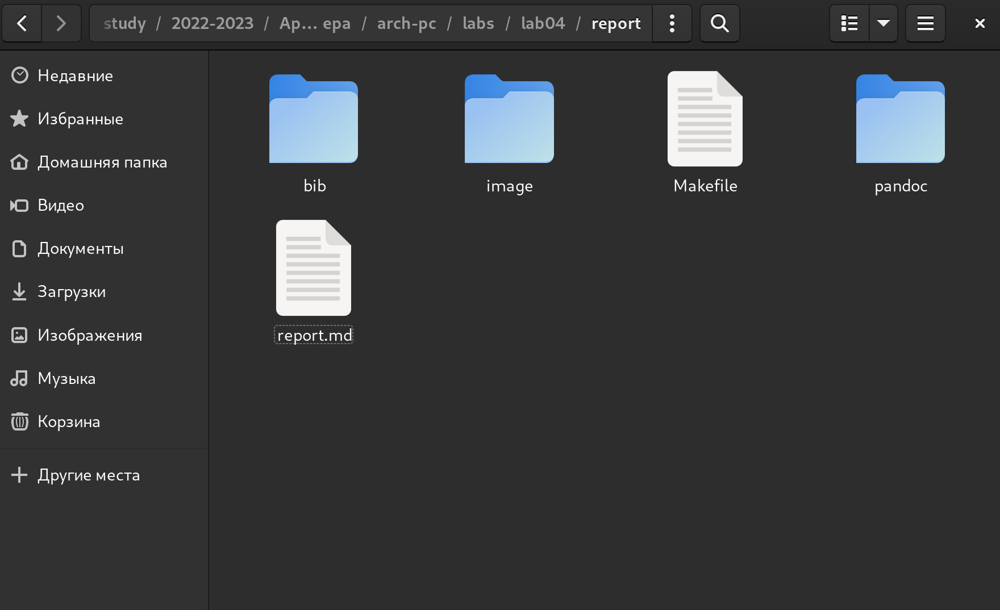{ #fig:007 width=70% }

Открою файл *report.md* c помощью текстового редактора gedit.(рис. [-@fig:008] и [-@fig:009])

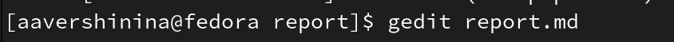{ #fig:008 width=70% }

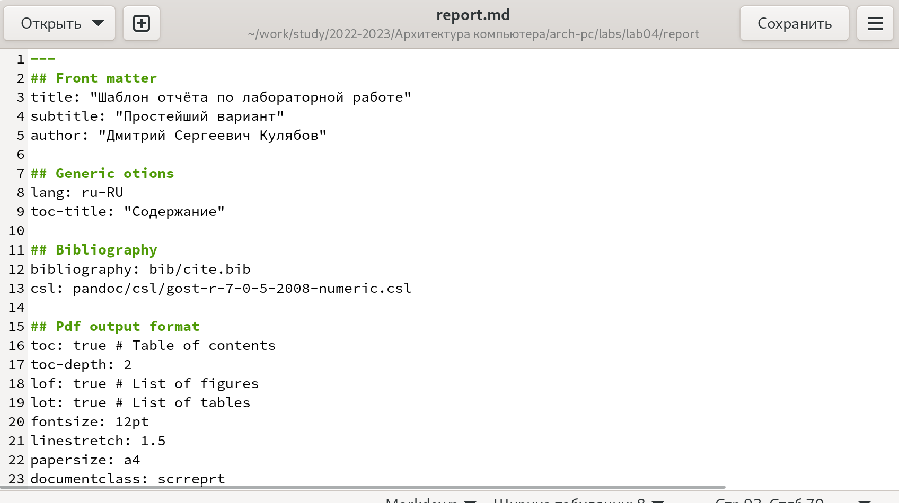{ #fig:009 width=70% }

Приступлю к заполнению отчета лабораторной работы. Далее скомпилирую файлы в форматы *.docx* и *.pdf* и загружу файлы на Github.

#Задание для самостоятельной работы

Перейду в соответствующий каталог лабораторной работы №3.(рис. [-@fig:0010])

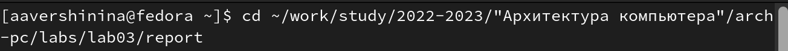{ #fig:0010 width=70% }

Открою файл *report.md* в текстов редакторе. (рис. [-@fig:0011] и [-@fig:0012])

{ #fig:0011 width=70% }

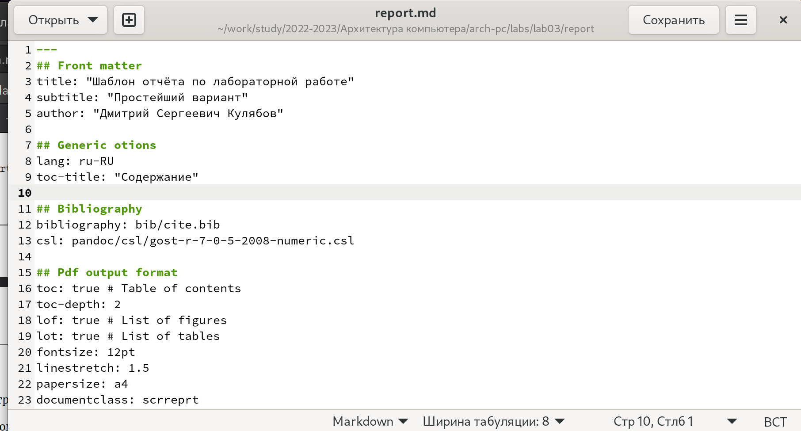{ #fig:0012 width=70% }

И приступлю к оформлению отчета в формате Markdown  в файле *report.md*.(рис. [-@fig:0013])

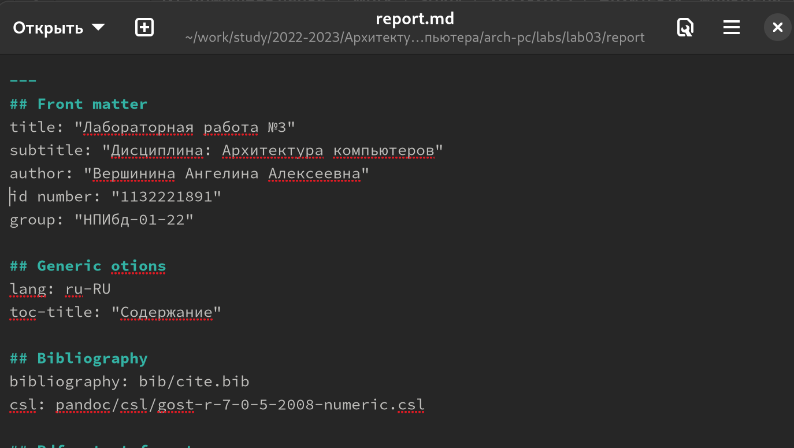{ #fig:0013 width=70% }

При помощи команды **make** скомпилирую в форматы *.docx* и *.pdf*.(рис. [-@fig:0014])

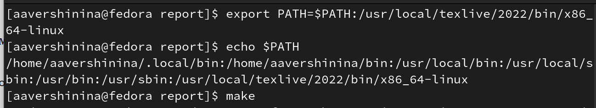{ #fig:0014 width=70% }

Загружу файлы на Github. (рис. [-@fig:0015] и [-@fig:0016])

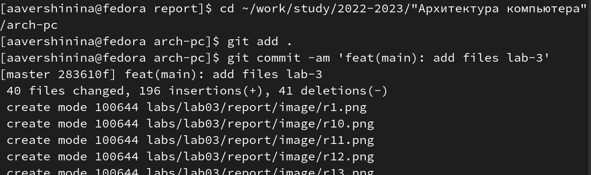{ #fig:0015 width=70% }

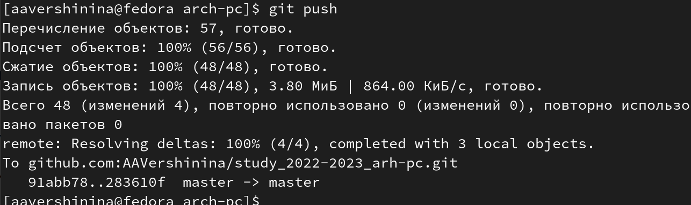{ #fig:0016 width=70% }

# Выводы

В результате проделанной работы я научилась оформлять документы в языке разметки Markdown.

# Список литературы{.unnumbered}

::: {#refs}
:::
