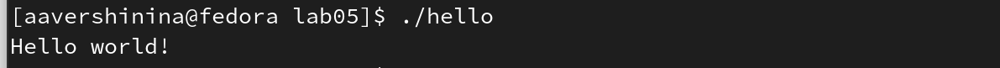

---
## Front matter
title: "Лабораторная работа №5"
subtitle: "Создание и
процесс обработки программ на языке
ассемблера NASM"
author: "Вершинина Ангелина Алексеевна"

## Generic otions
lang: ru-RU
toc-title: "Содержание"

## Bibliography
bibliography: bib/cite.bib
csl: pandoc/csl/gost-r-7-0-5-2008-numeric.csl

## Pdf output format
toc: true # Table of contents
toc-depth: 2
lof: true # List of figures
lot: true # List of tables
fontsize: 12pt
linestretch: 1.5
papersize: a4
documentclass: scrreprt
## I18n polyglossia
polyglossia-lang:
  name: russian
  options:
	- spelling=modern
	- babelshorthands=true
polyglossia-otherlangs:
  name: english
## I18n babel
babel-lang: russian
babel-otherlangs: english
## Fonts
mainfont: PT Serif
romanfont: PT Serif
sansfont: PT Sans
monofont: PT Mono
mainfontoptions: Ligatures=TeX
romanfontoptions: Ligatures=TeX
sansfontoptions: Ligatures=TeX,Scale=MatchLowercase
monofontoptions: Scale=MatchLowercase,Scale=0.9
## Biblatex
biblatex: true
biblio-style: "gost-numeric"
biblatexoptions:
  - parentracker=true
  - backend=biber
  - hyperref=auto
  - language=auto
  - autolang=other*
  - citestyle=gost-numeric
## Pandoc-crossref LaTeX customization
figureTitle: "Рис."
tableTitle: "Таблица"
listingTitle: "Листинг"
lofTitle: "Список иллюстраций"
lotTitle: "Список таблиц"
lolTitle: "Листинги"
## Misc options
indent: true
header-includes:
  - \usepackage{indentfirst}
  - \usepackage{float} # keep figures where there are in the text
  - \floatplacement{figure}{H} # keep figures where there are in the text
---

# Цель работы

Целью данной лабораторной работы является освоение процедуры компиляции и сборки программ, написанных на ассемблере NASM
# Задание

Написать первые программы на языке NASM

# Теоретическое введение

Основными функциональными элементами любой электронно-вычислительной
машины (ЭВМ) являются центральный процессор, память и периферийные
устройства.
Взаимодействие этих устройств осуществляется через общую шину, к которой
они подключены. Физически шина представляет собой большое количество про-
водников, соединяющих устройства друг с другом. В современных компьютерах
проводники выполнены в виде электропроводящих дорожек на материнской
(системной) плате.

# Выполнение лабораторной работы

## Программа Hello world!

Создам каталог lab05 для работы с программами на языке ассемблера NASM(рис. [-@fig:001])

Перейду в созданный каталог (рис. [-@fig:001])

Создам текстовый файл с именем hello.asm (рис. [-@fig:001]) и открою этот файл с помощью  текстового редактора gedit (рис. [-@fig:002])

{ #fig:001 width=70% }

{ #fig:002 width=70% }

Введу в него  текст программы, выводящий текст *Hello, World!* (рис. [-@fig:003])

{ #fig:003 width=70% }

## Транслятор NASM

Скомпилирую текст программы в объектный код при помощи команды (рис. [-@fig:004])

С помощью команды ls проверю, что объектный файл был создан. Объектный файл файл имеет имя *hello.o* (рис. [-@fig:004])

{ #fig:004 width=70% }

## Расширенный синтаксис командной строки NASM

Выполню команду, которая скомпилирует исходный файл hello.asm в obj.o (опция -
o позволяет задать имя объектного файла, в данном случае obj.o), при этом
формат выходного файла будет elf, и в него будут включены символы для
отладки (опция -g), кроме того, будет создан файл листинга list.lst (опция
-l). С помощью команды ls проверьте, что файлы были созданы. (рис. [-@fig:005])

{ #fig:005 width=70% }

## Компоновщик LD

Чтобы получить исполняемую программу, объектный файл передам на обработку компоновщику. С помощью команды ls проверю, что исполняемый файл hello был создан.(рис. [-@fig:006])

{ #fig:006 width=70% }

Выполню следующую команду (рис. [-@fig:007]). Имя объектного файла *obj.o* и имя исполняемого файла *main*.

{ #fig:007 width=70% }

## Запуск исполняемого файла

Запущу на выполнение созданный исполняемый файл, находящийся в
текущем каталоге(рис. [-@fig:008])

{ #fig:008 width=70% }

# Задание для самостоятельной работы

В каталоге ~/work/arch-pc/lab05 с помощью команды cp создам копию
файла hello.asm с именем lab5.asm (рис. [-@fig:009])

{ #fig:009 width=70% }

Открою файл с помощью текстового редактора (рис. [-@fig:0010]) и внесу изменения в текст программы в файле lab5.asm так, чтобы вместо Hello world! на экран выводилась строка с моими фамилией и именем.(рис. [-@fig:0011])

{ #fig:0010 width=70% }

{ #fig:0011 width=70% }

Оттранслируйю полученный текст программы lab5.asm в объектный
файл. Выполню компоновку объектного файла и запущу получивший-
ся исполняемый файл. (рис. [-@fig:0012] и [-@fig:0013] )

{ #fig:0012 width=70% }

{ #fig:0013 width=70% }

Скопирую файлы hello.asm и lab5.asm в мой локальный репозиторий
в каталог ~/work/study/2022-2023/"Архитектура компьютера"/arch-
pc/labs/lab05/.(рис. [-@fig:0014]) Перейду в этот каталог.(рис. [-@fig:0015])

{ #fig:0014 width=70% }

{ #fig:0015 width=70% }

Загружу файлы на github (рис. [-@fig:0016])

{ #fig:0016 width=70% }

# Выводы

В результате выполнения данной лабораторной работы я освоила процедуры компиляции и сборки программ, написанных на ассемблере NASM

# Список литературы{.unnumbered}

::: {#refs}
:::
