---
## Front matter
title: "Лабораторная работа №6"
subtitle: "Основы работы с
Midnight Commander (mc). Структура
программы на языке ассемблера NASM.
Системные вызовы в ОС GNU Linux"
author: "Вершинина Ангелина Алексеевна"

## Generic otions
lang: ru-RU
toc-title: "Содержание"

## Bibliography
bibliography: bib/cite.bib
csl: pandoc/csl/gost-r-7-0-5-2008-numeric.csl

## Pdf output format
toc: true # Table of contents
toc-depth: 2
lof: true # List of figures
lot: true # List of tables
fontsize: 12pt
linestretch: 1.5
papersize: a4
documentclass: scrreprt
## I18n polyglossia
polyglossia-lang:
  name: russian
  options:
	- spelling=modern
	- babelshorthands=true
polyglossia-otherlangs:
  name: english
## I18n babel
babel-lang: russian
babel-otherlangs: english
## Fonts
mainfont: PT Serif
romanfont: PT Serif
sansfont: PT Sans
monofont: PT Mono
mainfontoptions: Ligatures=TeX
romanfontoptions: Ligatures=TeX
sansfontoptions: Ligatures=TeX,Scale=MatchLowercase
monofontoptions: Scale=MatchLowercase,Scale=0.9
## Biblatex
biblatex: true
biblio-style: "gost-numeric"
biblatexoptions:
  - parentracker=true
  - backend=biber
  - hyperref=auto
  - language=auto
  - autolang=other*
  - citestyle=gost-numeric
## Pandoc-crossref LaTeX customization
figureTitle: "Рис."
tableTitle: "Таблица"
listingTitle: "Листинг"
lofTitle: "Список иллюстраций"
lotTitle: "Список таблиц"
lolTitle: "Листинги"
## Misc options
indent: true
header-includes:
  - \usepackage{indentfirst}
  - \usepackage{float} # keep figures where there are in the text
  - \floatplacement{figure}{H} # keep figures where there are in the text
---

# Цель работы

Приобретение практических навыков работы в Midnight Commander. Освоение
инструкций языка ассемблера mov и int.

# Задание

Написать программы принимающие на ввод строку и вывод ее.

# Теоретическое введение

Midnight Commander (или просто mc) — это программа, которая позволяет
просматривать структуру каталогов и выполнять основные операции по управ-
лению файловой системой, т.е. mc является файловым менеджером. Midnight
Commander позволяет сделать работу с файлами более удобной и наглядной.


# Выполнение лабораторной работы

Открою Midnight Commander (рис. [-@fig:001])

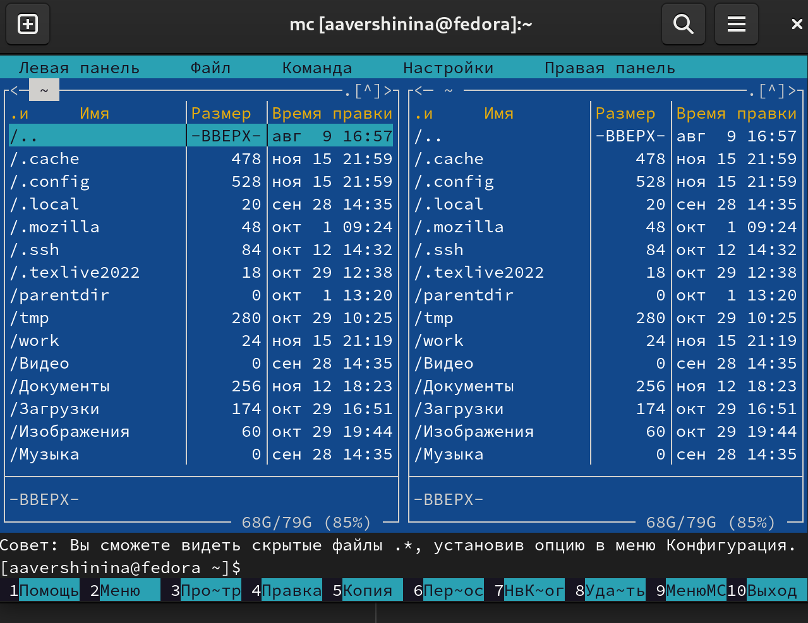{ #fig:001 width=70% }

Пользуясь клавишами ↑ , ↓ и Enter перейду в каталог ~/work/arch-pc (рис. [-@fig:002])

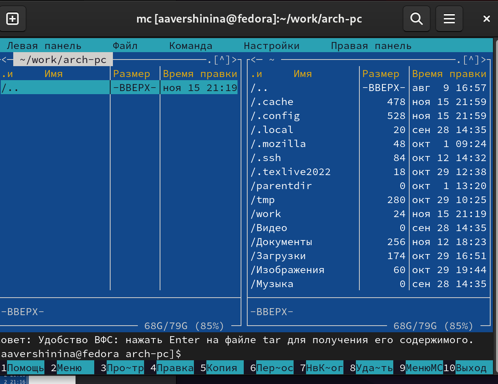{ #fig:002 width=70% }

С помощью функциональной клавиши F7 создам папку lab06 (рис. [-@fig:003])
и перейду в созданный каталог.

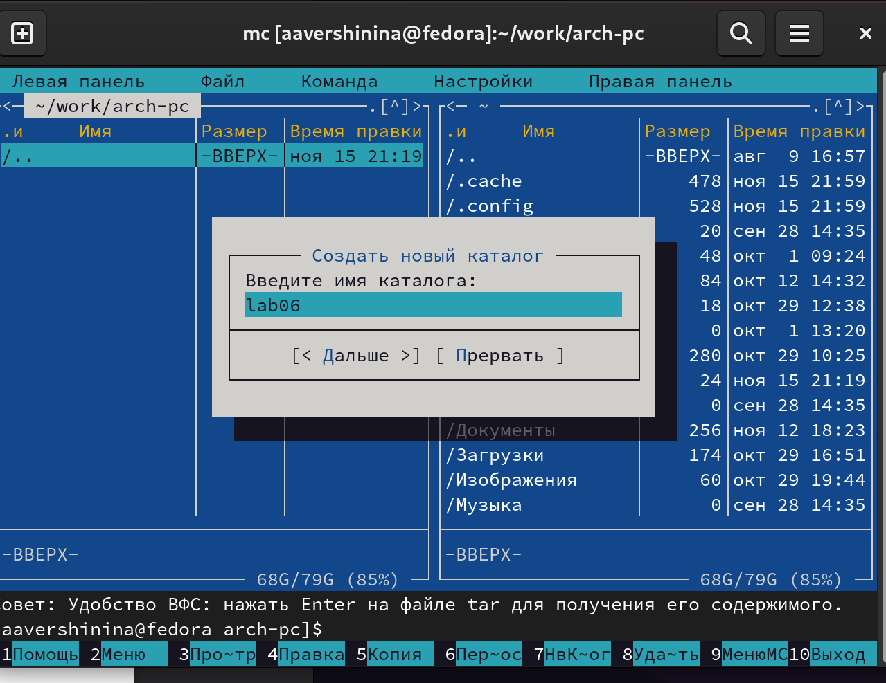{ #fig:003 width=70% }

Пользуясь строкой ввода и командой touch создам файл lab6-1.asm (рис. [-@fig:004])

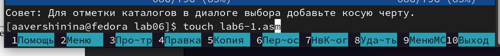{ #fig:004 width=70% }

С помощью функциональной клавиши F4 открою файл lab6-1.asm для редактирования во встроенном редакторе (рис. [-@fig:005])

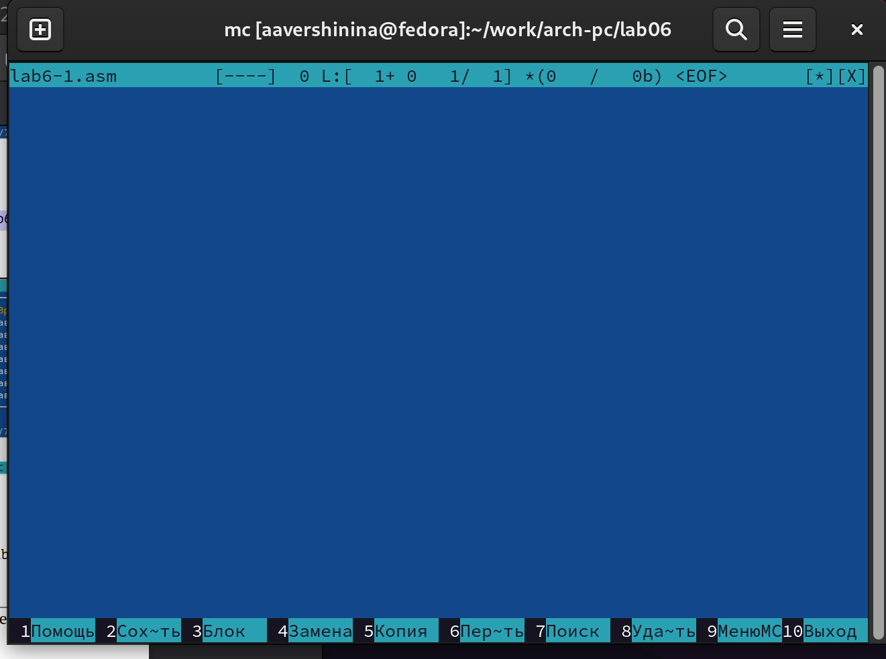{ #fig:005 width=70% }

Введу текст программы из листинга 6.1 (рис. [-@fig:006]), со-
храню изменения (рис. [-@fig:007]) и закрою файл.

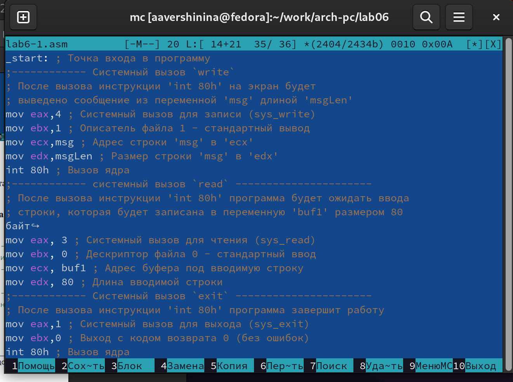{ #fig:006 width=70% }

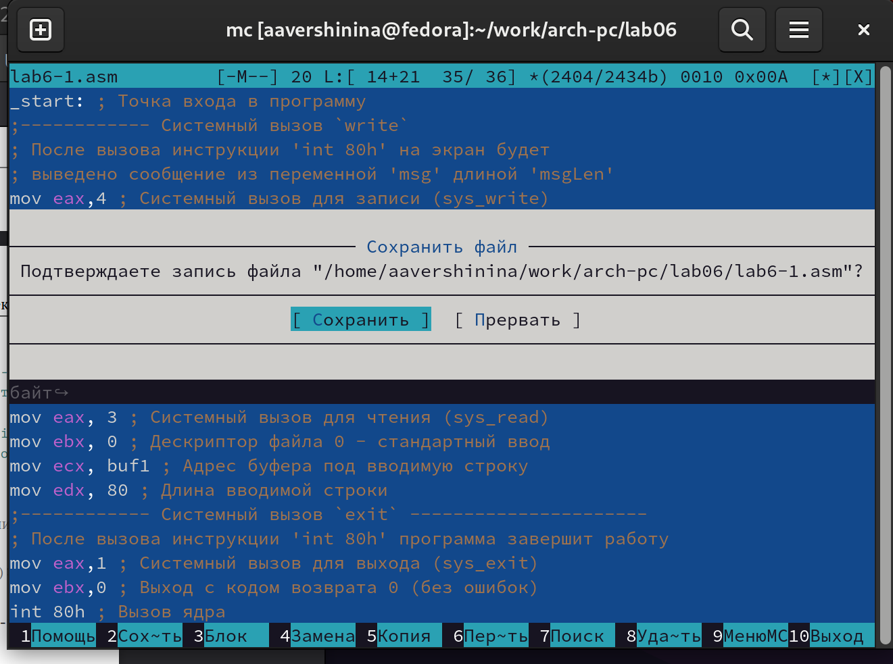{ #fig:007 width=70% }

С помощью функциональной клавиши F3 открою файл lab6-1.asm для
просмотра. Файл действительно содержит текст программы.

Оттранслирую текст программы lab6-1.asm в объектный файл. Выполню компоновку объектного файла и запущу получившийся исполняемый
файл. Программа выводит строку 'Введите строку:' и ожидает ввода с
клавиатуры. На запрос введу фамилию и имя (рис. [-@fig:008])

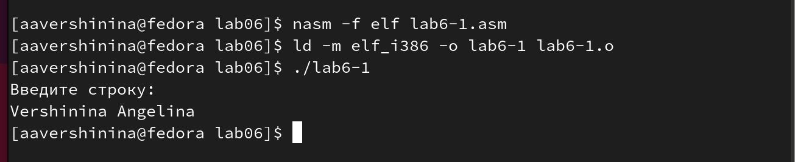{ #fig:008 width=70% }

## Подключение внешнего файла in_out.asm

Скачаю файл in_out.asm со страницы курса в ТУИС. В одной из панелей mc открою каталог с файлом lab6-1.asm. В другой панели
каталог со скаченным файлом in_out.asm. (рис. [-@fig:009])

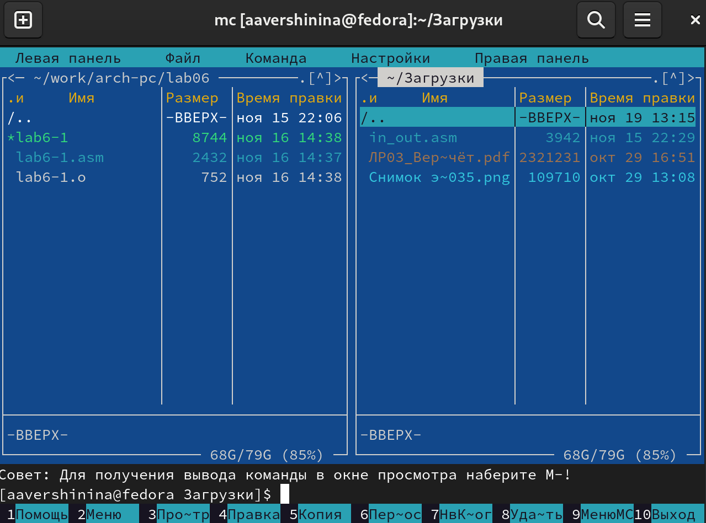{ #fig:009 width=70% }

Скопирую файл in_out.asm в каталог с файлом lab6-1.asm
с помощью функциональной клавиши F5 (рис. [-@fig:0010])

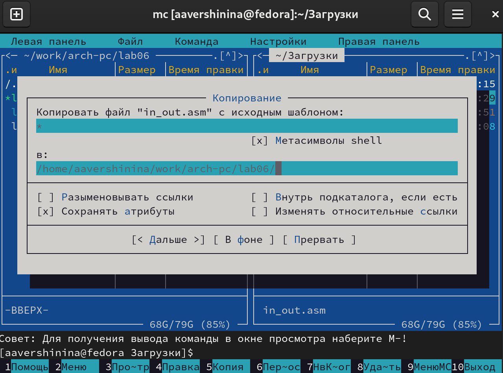{ #fig:0010 width=70% }

С помощью функциональной клавиши F6 создам копию файла lab6-
1.asm с именем lab6-2.asm. Выделю файл lab6-1.asm, нажму клавишу
F6 , введу имя файла lab6-2.asm и нажму клавишу Enter (рис. [-@fig:0011])

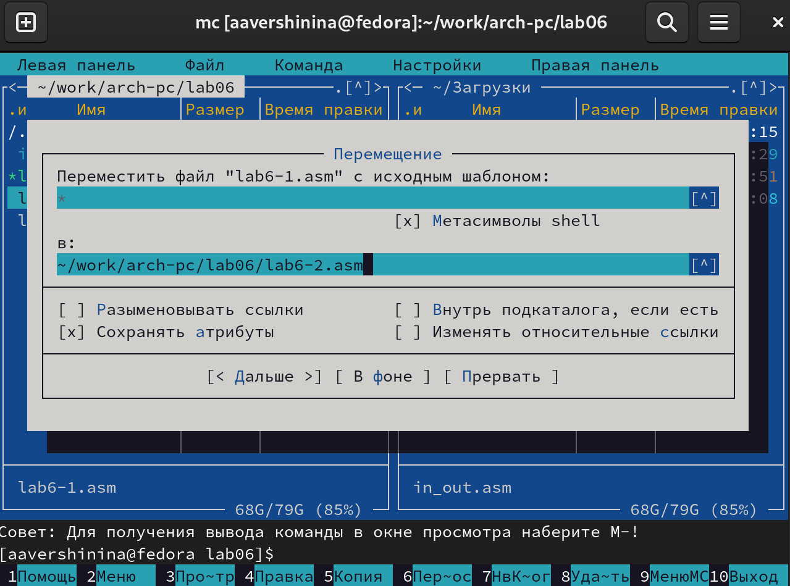{ #fig:0011 width=70% }

Исправлю текст программы в файле lab6-2.asm с использование под-
программ из внешнего файла in_out.asm  в соответствии с листингом 6.2. Создам испол-
няемый файл и проверьте его работу (рис. [-@fig:0012])

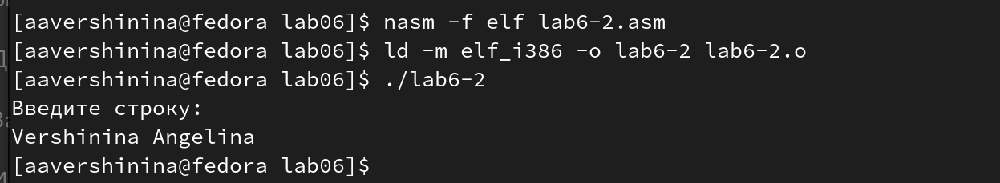{ #fig:0012 width=70% }

В файле lab6-2.asm заменю подпрограмму sprintLF на sprint. (рис. [-@fig:0013])
Создам исполняемый файл и проверю его работу.(рис. [-@fig:0014]) Отличие sprintLF и sprint заключается в том, что в первом случае программа запрашивает ввод данных с новой строки, а во втором не происходит переноса строки для ввода данных.

{ #fig:0013 width=70% }

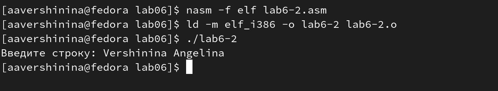{ #fig:0014 width=70% }

## Выполнение заданий для самостоятельной работы

1. Создам копию файла lab6-1.asm с именем lab6-11.asm с помощью функциональной клавиши F5. С помощью функциональной клавиши F4 открываю созданный файл для редактирования. Изменю программу так, чтобы кроме вывода приглашения и запроса ввода, производился вывод вводимой пользователем строки (рис. [-@fig:0015])

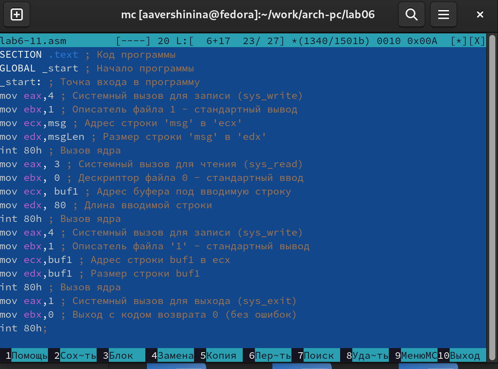{ #fig:0015 width=70% }

Создам исполняемый файл и проверю его работу. Программа запрашивает ввод строки, ввожу свою фамилию, программа выводит введенную строку(рис. [-@fig:0016])

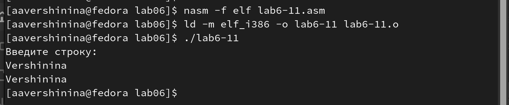{ #fig:0016 width=70% }

**Листинг программы 1**

```nasm

SECTION .data ; Секция инициированных данных
msg: DB 'Введите строку:',10
msgLen: EQU $-msg ; Длина переменной 'msg'
SECTION .bss ; Секция не инициированных данных
buf1: RESB 80 ; Буфер размером 80 байт
SECTION .text ; Код программы
GLOBAL _start ; Начало программы
_start: ; Точка входа в программу
mov eax,4 ; Системный вызов для записи (sys_write)
mov ebx,1 ; Описатель файла 1 - стандартный вывод
mov ecx,msg ; Адрес строки 'msg' в 'ecx'
mov edx,msgLen ; Размер строки 'msg' в 'edx'
int 80h ; Вызов ядра
mov eax, 3 ; Системный вызов для чтения (sys_read)
mov ebx, 0 ; Дескриптор файла 0 - стандартный ввод
mov ecx, buf1 ; Адрес буфера под вводимую строку
mov edx, 80 ; Длина вводимой строки
int 80h ; Вызов ядра
mov eax,4 ; Системный вызов для записи (sys_write)
mov ebx,1 ; Описатель файла '1' - стандартный вывод
mov ecx,buf1 ; Адрес строки buf1 в ecx
mov edx,buf1 ; Размер строки buf1
int 80h ; Вызов ядра
mov eax,1 ; Системный вызов для выхода (sys_exit)
mov ebx,0 ; Выход с кодом возврата 0 (без ошибок)
int 80h ; Вызов ядра

```

2. Создам копию файла lab6-2.asm с именем lab6-2-1.asm с помощью функциональной клавиши F5. С помощью функциональной клавиши F4 открываю созданный файл для редактирования. Изменю программу так, чтобы кроме вывода приглашения и запроса ввода, производился вывод вводимой пользователем строки.

Создам исполняемый файл и проверю его работу. Программа запрашивает ввод строки, ввожу свою фамилию, программа выводит введенную строку(рис. [-@fig:0017])

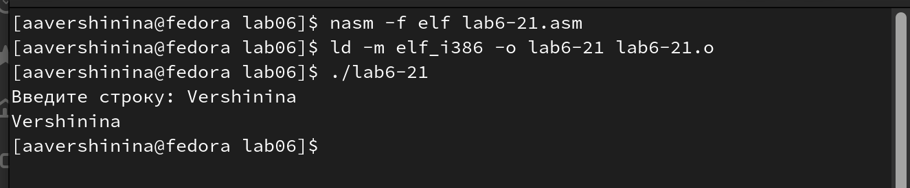{ #fig:0017 width=70% }

**Листинг программы 2**

```nasm

%include 'in_out.asm'
SECTION .data ; Секция инициированных данных
msg: DB 'Введите строку: ',0h ; сообщение
SECTION .bss ; Секция не инициированных данных
buf1: RESB 80 ; Буфер размером 80 байт
SECTION .text ; Код программы
GLOBAL _start ; Начало программы
_start: ; Точка входа в программу
mov eax, msg ; запись адреса выводимого сообщения в `EAX`
call sprint ; вызов подпрограммы печати сообщения
mov ecx, buf1 ; запись адреса переменной в `EAX`
mov edx, 80 ; запись длины вводимого сообщения в `EBX`
call sread ; вызов подпрограммы ввода сообщения
mov eax,4 ; Системный вызов для записи (sys_write)
mov ebx,1 ; Описатель файла '1' - стандартный вывод
mov ecx,buf1 ; Адрес строки buf1 в ecx
int 80h ; Вызов ядра
call quit ; вызов подпрограммы завершения

```

# Выводы

При выполнении данной лабораторной работы я приобрела практические навыки работы в Midnight Commander, а также освоила инструкции языка ассемблера mov и int.

# Список литературы{.unnumbered}

::: {#refs}
:::
