---
## Front matter
title: "Лабораторная работа №7"
subtitle: "Арифметические операции в NASM"
author: "Вершинина Ангелина Алексеевна"

## Generic otions
lang: ru-RU
toc-title: "Содержание"

## Bibliography
bibliography: bib/cite.bib
csl: pandoc/csl/gost-r-7-0-5-2008-numeric.csl

## Pdf output format
toc: true # Table of contents
toc-depth: 2
lof: true # List of figures
lot: true # List of tables
fontsize: 12pt
linestretch: 1.5
papersize: a4
documentclass: scrreprt
## I18n polyglossia
polyglossia-lang:
  name: russian
  options:
	- spelling=modern
	- babelshorthands=true
polyglossia-otherlangs:
  name: english
## I18n babel
babel-lang: russian
babel-otherlangs: english
## Fonts
mainfont: PT Serif
romanfont: PT Serif
sansfont: PT Sans
monofont: PT Mono
mainfontoptions: Ligatures=TeX
romanfontoptions: Ligatures=TeX
sansfontoptions: Ligatures=TeX,Scale=MatchLowercase
monofontoptions: Scale=MatchLowercase,Scale=0.9
## Biblatex
biblatex: true
biblio-style: "gost-numeric"
biblatexoptions:
  - parentracker=true
  - backend=biber
  - hyperref=auto
  - language=auto
  - autolang=other*
  - citestyle=gost-numeric
## Pandoc-crossref LaTeX customization
figureTitle: "Рис."
tableTitle: "Таблица"
listingTitle: "Листинг"
lofTitle: "Список иллюстраций"
lotTitle: "Список таблиц"
lolTitle: "Листинги"
## Misc options
indent: true
header-includes:
  - \usepackage{indentfirst}
  - \usepackage{float} # keep figures where there are in the text
  - \floatplacement{figure}{H} # keep figures where there are in the text
---

# Цель работы

Освоение арифметических инструкций языка ассемблера NASM

# Задание

Написание программ с использование арифметических действий

# Теоретическое введение

Большинство инструкций на языке ассемблера требуют обработки операндов.
Адрес операнда предоставляет место, где хранятся данные, подлежащие обра-
ботке. Это могут быть данные хранящиеся в регистре или в ячейке памяти. Далее
рассмотрены все существующие способы задания адреса хранения операндов –
способы адресации.

Существует три основных Большинство инструкций на языке ассемблера требуют обработки операндов.
Адрес операнда предоставляет место, где хранятся данные, подлежащие обра-
ботке. Это могут быть данные хранящиеся в регистре или в ячейке памяти. Далее
рассмотрены все существующие способы задания адреса хранения операндов –
способы адресации.
Существует три основных способа адресации:

1. Регистровая адресация – операнды хранятся в регистрах и в команде
используются имена этих регистров, например: mov ax,bx.
2. Непосредственная адресация – значение операнда задается непосред-
ственно в команде, Например: mov ax,2.
3. Адресация памяти – операнд задает адрес в памяти. В команде указывает-
ся символическое обозначение ячейки памяти, над содержимым которой
требуется выполнить операцию.


# Выполнение лабораторной работы

## Символьные и численные данные в NASM

Создам каталог для программам лабораторной работы  №7, перейду в
него и создам файл lab7-1.asm (рис. [-@fig:001])

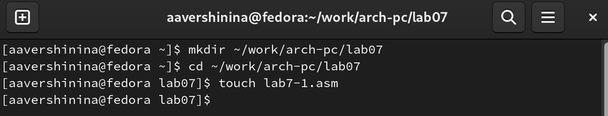{ #fig:001 width=70% }

**Пример программы 1**

Программы буду выводить значения записанные в регистр eax.

Введу в файл lab7-1.asm текст программы из листинга 7.1. В данной программе в регистр eax записывается символ 6, в регистр ebx символ 4. Далее к значению в регистре eax прибавляю значение регистра ebx и результат сложения запишу в регистр ea. Далее вывожу результат. Так как для работы функции sprintLF в регистр
eax должен быть записан адрес, необходимо использовать дополнительную
переменную. Для этого запишу значение регистра eax в переменную buf1, а затем запишу адрес переменной buf1 в регистр eax  и вызову функцию sprintLF.

Далее создам исполняемый файл и запущу его. (рис. [-@fig:002]) Результатом является символ j. Это происходит потому, что код
символа 6 равен 00110110 в двоичном представлении (или 54 в десятичном
представлении), а код символа 4 – 00110100 (52). Команда add eax,ebx запишет
в регистр eax сумму кодов – 01101010 (106), что в свою очередь является кодом
символа j.

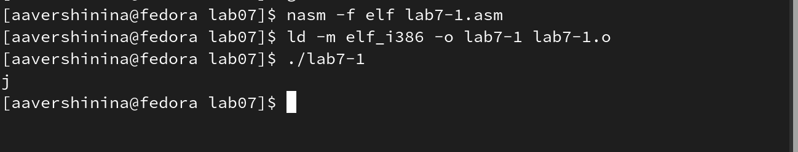{ #fig:002 width=70% }


**Пример программы 2**

Далее изменю текст программы и вместо символов, запишу в регистры числа. Исправлю текст программы 1 следующим образом: (рис. [-@fig:003])

заменю строки

```nasm
mov eax,'6'
mov ebx,'4'
```

на строки

```nasm
mov eax,6
mov ebx,4
```
{ #fig:003 width=70% }

Создам исполняемый файл и запущу его. (рис. [-@fig:004]) Как и в предыдущем случае при исполнении программы мы не получили число 10. В данном случае выводится символ с кодом 10. Пользуясь таблицей ASCII определю какому символу соответствует код 10.
Это символ перевода строки и он не отображается при выводе на экран.

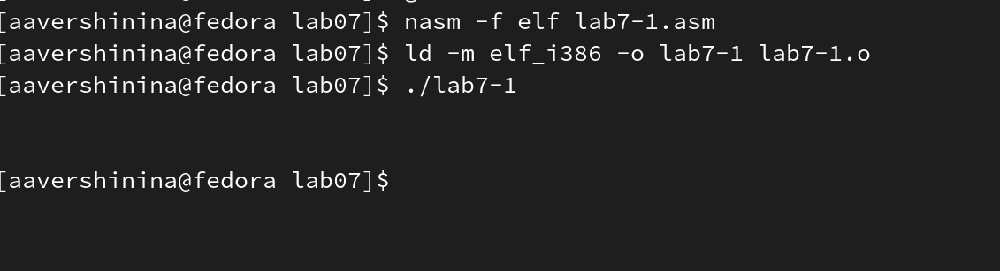{ #fig:004 width=70% }

**Пример программы 3**

Создам файл lab7-2.asm в каталоге ~/work/arch-pc/lab07 (рис. [-@fig:005]) и введу в него
текст программы из листинга 7.2. Создам исполняемый файл и запущу его.(рис. [-@fig:006])
В результате работы программы получилось число 106. В данном случае, как
и в первом, команда add складывает коды символов ‘6’ и ‘4’ (54+52=106). Однако,
в отличии от программы из листинга 7.1, функция iprintLF позволяет вывести
число, а не символ, кодом которого является это число.

{ #fig:005 width=70% }

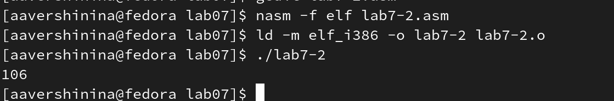{ #fig:006 width=70% }

Аналогично предыдущему примеру изменим символы на числа. 

Заменю строки

```nasm
mov eax,'6'
mov ebx,'4'
```

на строки (рис. [-@fig:007])

```nasm
mov eax,6
mov ebx,4
```

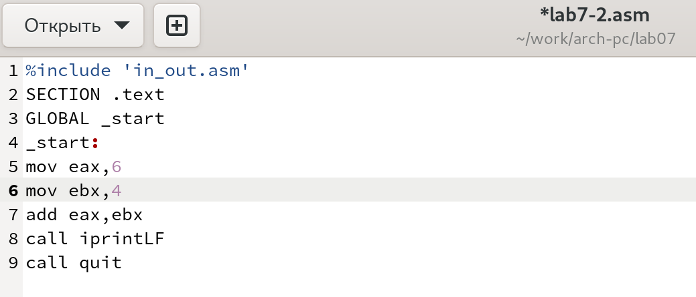{ #fig:007 width=70% }

Создам исполняемый файл и запущу его. (рис. [-@fig:008]) результат выполнения программы - 10.

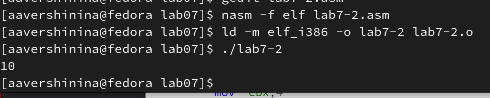{ #fig:008 width=70% }

Заменю функцию iprintLF на iprint. (рис. [-@fig:009]) Создам исполняемый файл и запущу его.(рис. [-@fig:0010]) Отличие вывода iprintLF и iprint: в первом случае после вывода происходит перенос строки, а втором нет переноса на новую строку

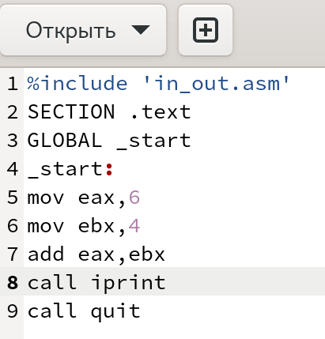{ #fig:009 width=70% }

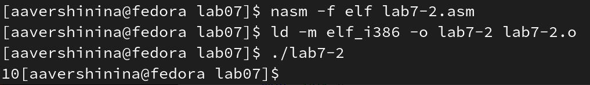{ #fig:0010 width=70% }

## Выполнение арифметических операций в NASM

В качестве примера выполнения арифметических операций в NASM приведe программу вычисления арифметического выражения 𝑓(𝑥) = (5 ∗ 2 + 3)/3

Создам файл lab7-3.asm в каталоге ~/work/arch-pc/lab07 (рис. [-@fig:0011])

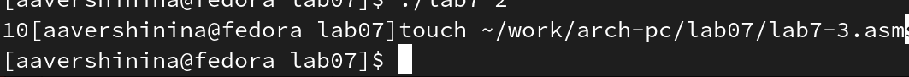{ #fig:0011 width=70% }

Внимательно изучу текст программы из листинга 7.3 и введу в lab7-3.asm. Создам исполняемый файл и запущу его (рис. [-@fig:0012])

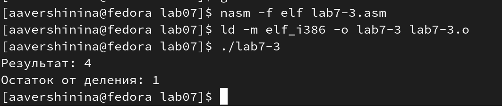{ #fig:0012 width=70% }

Изменю текст программы для вычисления выражения 𝑓(𝑥) = (4 ∗ 6 + 2)/5.(рис. [-@fig:0013])
Создам исполняемый файл и проверю его работу.(рис. [-@fig:0014])

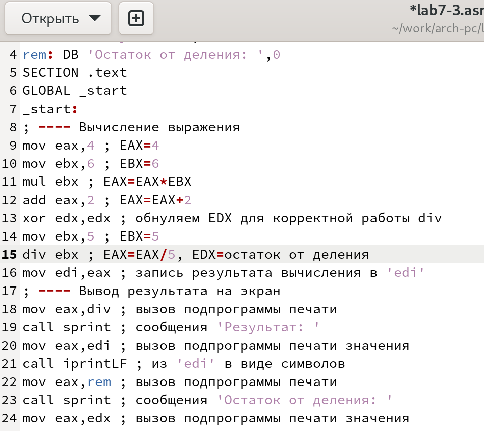{ #fig:0013 width=70% }

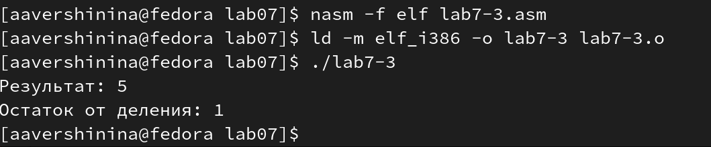{ #fig:0014 width=70% }

В качестве другого примера рассмотрим программу вычисления варианта задания по номеру студенческого билета, работающую по следующему
алгоритму:

1. вывести запрос на введение No студенческого билета
2. вычислить номер варианта по формуле: (𝑆𝑛 mod 20) + 1, где 𝑆𝑛 –
номер студенческого билета (В данном случае 𝑎 mod 𝑏 – это остаток
от деления 𝑎 на 𝑏).
3. вывести на экран номер варианта.

В данном случае число, над которым необходимо проводить арифметические
операции, вводится с клавиатуры. Как отмечалось выше ввод с клавиатуры
осуществляется в символьном виде и для корректной работы арифметических
операций в NASM символы необходимо преобразовать в числа. Для этого может
быть использована функция atoi из файла in_out.asm.

Создам файл variant.asm в каталоге ~/work/arch-pc/lab07. Внимательно изучу текст программы из листинга 7.4 и введу в файл variant.asm. Создам исполняемый файл и запущу его. (рис. [-@fig:0015])

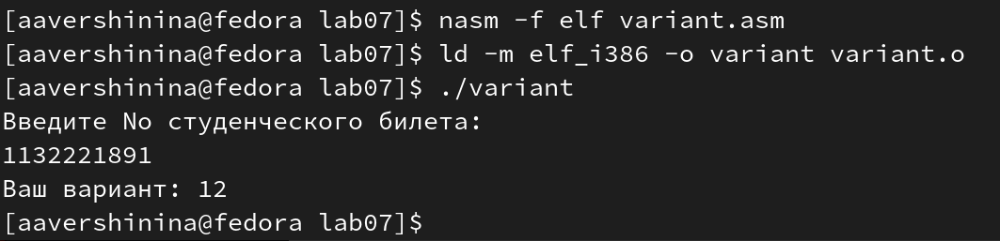{ #fig:0015 width=70% }

**Ответы на вопросы**

1. За вывод сообщения "Ваш вариант" отвечают строки кода

```nasm
mov eax,rem
call sprint
```

2. Инструкция mov ecx, x используется, чтобы положить адрес вводимой строки x в регистр ecx mov edx; 80 - запись в регистр edx длины вводимой строки call sread - вызов подпрограммы из внешнего файла, обеспечивающей ввод сообщения с клавиатуры

3. call atoi используется для вызова подпрограммы из внешнего файла, которая преобразует ASCII-код символа в целое число и записывает результат в регистр eax

4. За вычисления варианта отвечают строки

```nasm
xor edx,edx ; обнуление edx для корректной работы div
mov ebx,20 ; ebx = 20
div ebx ; eax = eax/20, edx - остаток от деления
inc edx ; edx = edx + 1
```
5. При выполнении инструкции div ebx остаток от деления записывается в регистр edx

6. Инструкция inc edx увеличивает значение регистра edx на 1

7. За вывод на экран результатов вычислений отвечают строки

```nasm
mov eax,edx
call iprintLF
```

## Задание для самостоятельной работы

Необходимо написать программу вычисления выражения 𝑦 = 𝑓(𝑥). Программа должна
выводить выражение для вычисления, выводить запрос на ввод значения
𝑥, вычислять заданное выражение в зависимости от введенного 𝑥, выво-
дить результат вычислений. Вид функции 𝑓(𝑥)= (8х-6)/2

Создам файл для выполнения задания (рис. [-@fig:0016])

{ #fig:0016 width=70% }

Создам исполняемый файл и проверю его работу для значений 𝑥1 = 1 и 𝑥2 = 5. (рис. [-@fig:0017] и [-@fig:0018])

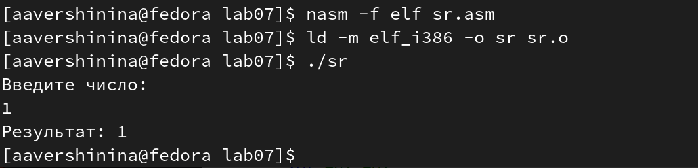{ #fig:0017 width=70% }

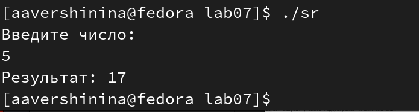{ #fig:0018 width=70% }

**Листинг программы**

```nasm
%include 'in_out.asm'
SECTION .data
fun: DB 'F(x)=(8x-6)/2',0
msg: DB 'Введите число: ',0
rem: DB 'Результат: ',0
SECTION .bss
x: RESB 80
SECTION .text
GLOBAL _start
_start:
mov eax, msg
call sprintLF
mov ecx, x
mov edx, 80
call sread
mov eax,x ; eax=x
call atoi ; ASCII кода в число, `eax=x`
mov ebx, 8 ; ebx = 8
mul ebx ; eax = eax*ebx
sub eax, 6 ; eax - 6
mov ebx, 2 ; ebx = 2
div ebx ; eax = eax/2
mov edi, eax ; запись результата в edi
mov eax, rem
call sprint
mov eax, edi
call iprintLF
call quit
```


# Выводы

В результате проделанной работы я освоила арифметических инструкций языка ассемблера NASM.

# Список литературы{.unnumbered}

::: {#refs}
:::
