---
## Front matter
title: "Лабораторная работа №8"
subtitle: "Команды
безусловного и условного переходов в
Nasm. Программирование ветвлений"
author: "Вершинина Ангелина Алексеевна"

## Generic otions
lang: ru-RU
toc-title: "Содержание"

## Bibliography
bibliography: bib/cite.bib
csl: pandoc/csl/gost-r-7-0-5-2008-numeric.csl

## Pdf output format
toc: true # Table of contents
toc-depth: 2
lof: true # List of figures
lot: true # List of tables
fontsize: 12pt
linestretch: 1.5
papersize: a4
documentclass: scrreprt
## I18n polyglossia
polyglossia-lang:
  name: russian
  options:
	- spelling=modern
	- babelshorthands=true
polyglossia-otherlangs:
  name: english
## I18n babel
babel-lang: russian
babel-otherlangs: english
## Fonts
mainfont: PT Serif
romanfont: PT Serif
sansfont: PT Sans
monofont: PT Mono
mainfontoptions: Ligatures=TeX
romanfontoptions: Ligatures=TeX
sansfontoptions: Ligatures=TeX,Scale=MatchLowercase
monofontoptions: Scale=MatchLowercase,Scale=0.9
## Biblatex
biblatex: true
biblio-style: "gost-numeric"
biblatexoptions:
  - parentracker=true
  - backend=biber
  - hyperref=auto
  - language=auto
  - autolang=other*
  - citestyle=gost-numeric
## Pandoc-crossref LaTeX customization
figureTitle: "Рис."
tableTitle: "Таблица"
listingTitle: "Листинг"
lofTitle: "Список иллюстраций"
lotTitle: "Список таблиц"
lolTitle: "Листинги"
## Misc options
indent: true
header-includes:
  - \usepackage{indentfirst}
  - \usepackage{float} # keep figures where there are in the text
  - \floatplacement{figure}{H} # keep figures where there are in the text
---

# Цель работы

Изучение команд условного и безусловного переходов. Приобретение навы-
ков написания программ с использованием переходов. Знакомство с назначе-
нием и структурой файла листинга.

# Задание

Написание программ, используя полученные знания

# Теоретическое введение

Безусловный переход выполняется инструкцией jmp (от англ. jump – прыжок),
которая включает в себя адрес перехода, куда следует передать управление:
mp <адрес_перехода>.
Адрес перехода может быть либо меткой, либо адресом области памяти, в
которую предварительно помещен указатель перехода. Кроме того, в качестве
операнда можно использовать имя регистра, в таком случае переход будет осу-
ществляться по адресу, хранящемуся в этом регистре

# Выполнение лабораторной работы

## Реализация переходов в NASM

Создайте каталог для программам лабораторной работы No 8, перейдите в
него и создайте файл lab8-1.asm (рис. [-@fig:001])

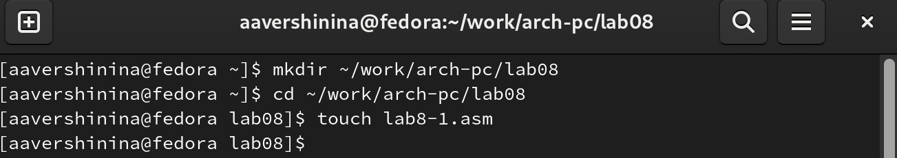{ #fig:001 width=70% }

Инструкция jmp в NASM используется для реализации безусловных пере-
ходов. Рассмотрим пример программы с использованием инструкции jmp.
Введите в файл lab8-1.asm текст программы из листинга 8.1 (рис. [-@fig:002])

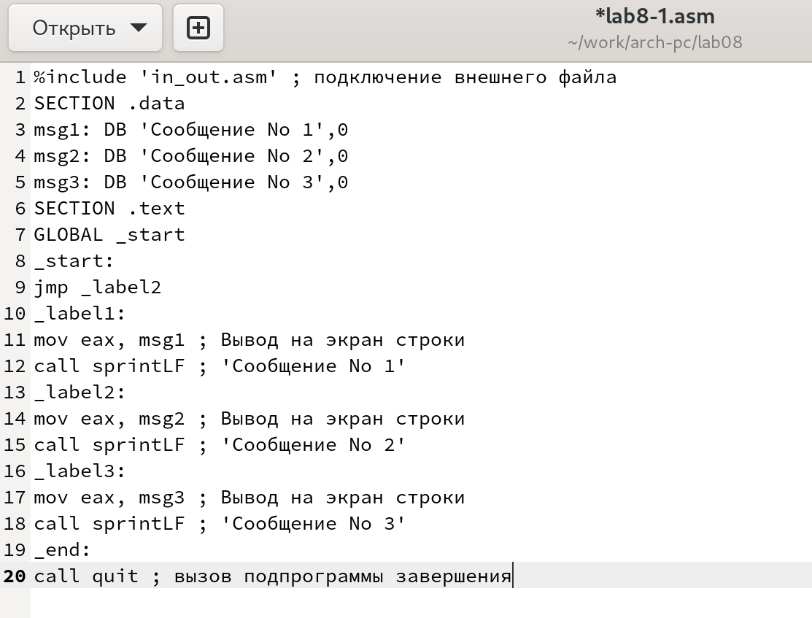{ #fig:002 width=70% }

Создайте исполняемый файл и запустите его (рис. [-@fig:003])

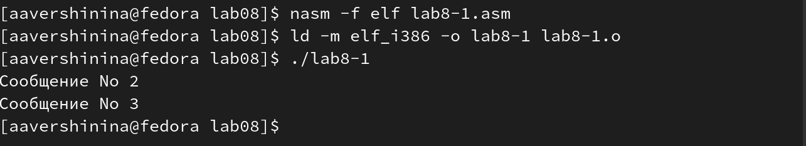{ #fig:003 width=70% }

Таким образом, использование инструкции jmp _label2 меняет порядок ис-
полнения инструкций и позволяет выполнить инструкции начиная с метки
_label2, пропустив вывод первого сообщения.

Инструкция jmp позволяет осуществлять переходы не только вперед но
и назад. Изменим программу таким образом, чтобы она выводила сначала
‘Сообщение No 2’, потом ‘Сообщение No 1’ и завершала работу. Для этого в
текст программы после вывода сообщения No 2 добавим инструкцию jmp с
меткой _label1 (т.е. переход к инструкциям вывода сообщения No 1) и после
вывода сообщения No 1 добавим инструкцию jmp с меткой _end (т.е. переход к
инструкции call quit). Измените текст программы в соответствии с листингом
8.2. (рис. [-@fig:003])

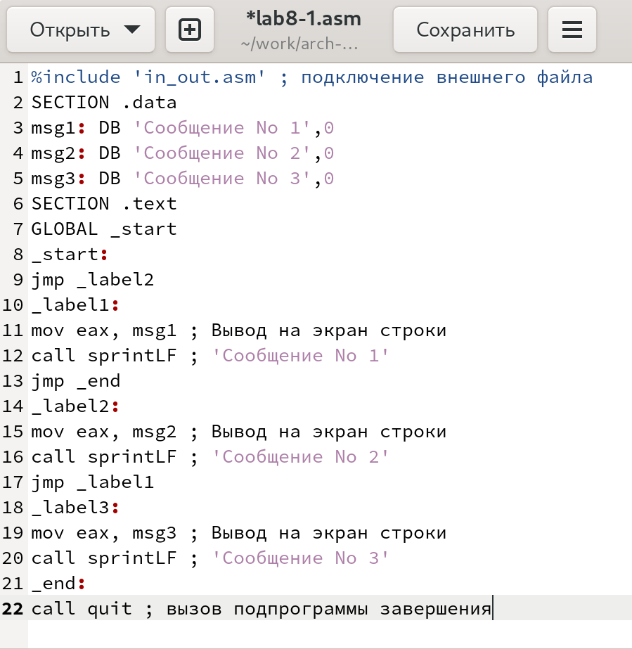{ #fig:004 width=70% }

Создайте исполняемый файл и запустите его (рис. [-@fig:005])

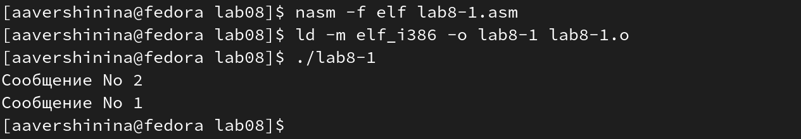{ #fig:005 width=70% }

Измените текст программы добавив или изменив инструкции jmp, чтобы
вывод программы был следующим:(рис. [-@fig:006])

```
Сообщение No 3
Сообщение No 2
Сообщение No 1
```

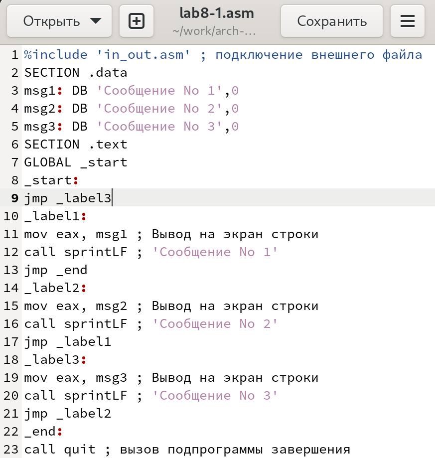{ #fig:006 width=70% }

Создайте исполняемый файл и запустите его (рис. [-@fig:007])

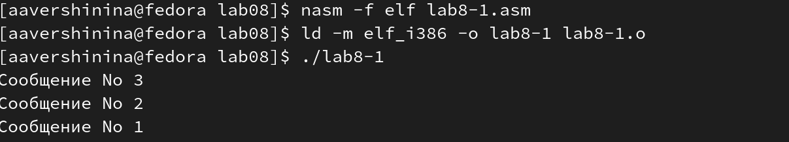{ #fig:007 width=70% }


Использование инструкции jmp приводит к переходу в любом случае. Од-
нако, часто при написании программ необходимо использовать условные
переходы, т.е. переход должен происходить если выполнено какое-либо
условие. В качестве примера рассмотрим программу, которая определяет
и выводит на экран наибольшую из 3 целочисленных переменных: A,B
и C. Значения для A и C задаются в программе, значение B вводиться с
клавиатуры.


Создайте файл lab8-2.asm в каталоге ~/work/arch-pc/lab08. Внимательно
изучите текст программы из листинга 8.3 и введите в lab8-2.asm. (рис. [-@fig:008])

{ #fig:008 width=70% }

Создайте исполняемый файл и запустите его (рис. [-@fig:009])

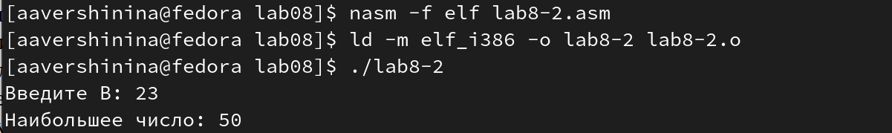{ #fig:009 width=70% }

Обратите внимание, в данном примере переменные A и С сравниваются как
символы, а переменная B и максимум из A и С как числа (для этого используется
функция atoi преобразования символа в число). Это сделано для демонстра-
ции того, как сравниваются данные. Данную программу можно упростить и
сравнивать все 3 переменные как символы (т.е. не использовать функцию atoi).
Однако если переменные преобразовать из символов числа, над ними можно
корректно проводить арифметические операции.

## Изучение структуры файлы листинга

Обычно nasm создаёт в результате ассемблирования только объектный
файл. Получить файл листинга можно, указав ключ -l и задав имя файла
листинга в командной строке. Создайте файл листинга для программы из
файла lab8-2.asm (рис. [-@fig:0010])

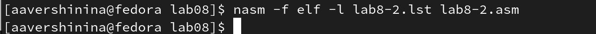{ #fig:0010 width=70% }

Откройте файл листинга lab8-2.lst с помощью любого текстового редактора,
например mcedit (рис. [-@fig:0011])

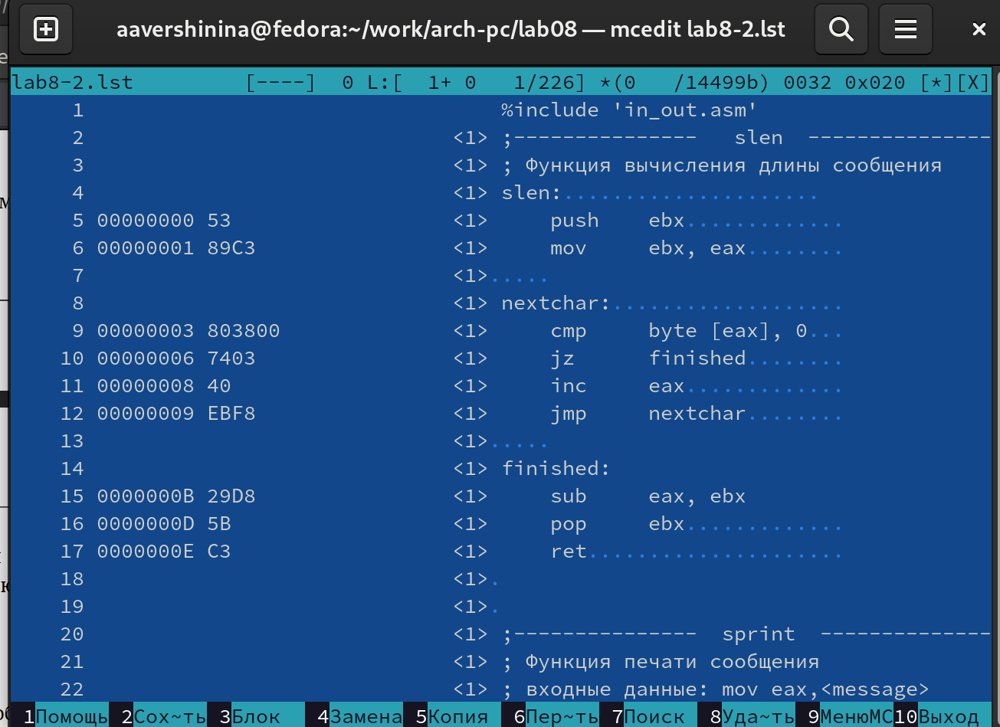{ #fig:0011 width=70% }

Внимательно ознакомиться с его форматом и содержимым. Подробно объяснить содержимое трёх строк файла листинга по выбору.

1. 6(номер строки) 00000001(адрес в сегменте кода) 89С3(машинный код) mov ebx,eax(исходный текст программы) (рис. [-@fig:0012])

2. 11(номер строки) 00000008(адрес в сегменте кода) 40(машинный код) inc eax(исходный текст программы) (рис. [-@fig:0013])

3. 54(номер строки) 0000003B(адрес в сегменте кода) E8CFFFFFFF(машинный код) call sprint(исходный текст программы) (рис. [-@fig:0014])

{ #fig:0012 width=70% }

{ #fig:0013 width=70% }

{ #fig:0014 width=70% }

Откройте файл с программой lab8-2.asm и в любой инструкции с двумя
операндами удалить один операнд.(рис. [-@fig:0015]) Выполните трансляцию с получением файла листинга (рис. [-@fig:0016]). В результате система выдает ошибку и создает файлы lab8-2 и lab8-2.lsl.

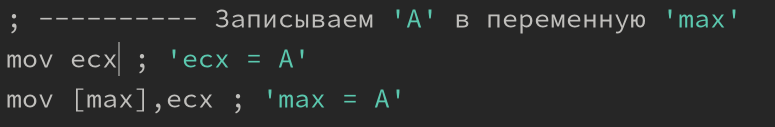{ #fig:0015 width=70% }

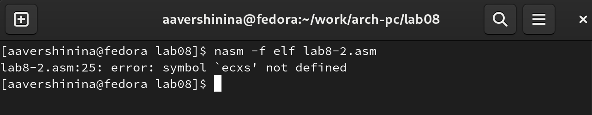{ #fig:0016 width=70% }

## Задание для самостоятельной работы

1. Напишите программу нахождения наименьшей из 3 целочисленных пере-
менных a, b и с. Значения переменных выбрать из табл. 8.5 в соответствии
с вариантом 12, полученным при выполнении лабораторной работы No 7. (рис. [-@fig:0017])
Создайте исполняемый файл и проверьте его работу. (рис. [-@fig:0018])

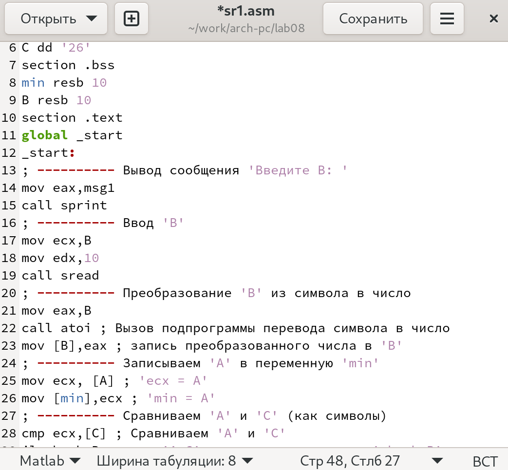{ #fig:0017 width=70% }

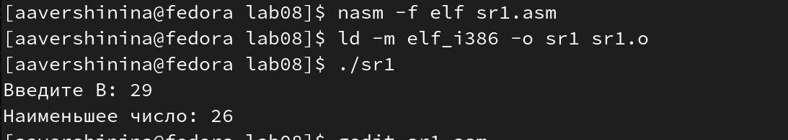{ #fig:0018 width=70% }

2. Напишите программу, которая для введенных с клавиатуры значений 𝑥
и 𝑎 вычисляет значение заданной функции 𝑓(𝑥) и выводит результат вы-
числений. Вид функции 𝑓(𝑥) выбрать из таблицы 8.6 вариантов заданий в
соответствии с вариантом 12, полученным при выполнении лабораторной
работы No 7. Создайте исполняемый файл и проверьте его работу для зна-
чений 𝑥 и 𝑎 из 8.6. (рис. [-@fig:0019])

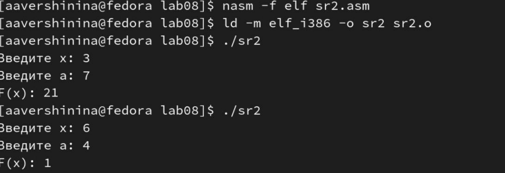{ #fig:0019 width=70% }

# Выводы

В результате выполнения лабораторной работы я изучила команды условного и безусловного переходов. Приобрела навыки написания программ с использованием переходов. Ознакомилась с назначением и структурой файла листинга.

# Список литературы{.unnumbered}

::: {#refs}
:::
