---
## Front matter
title: "Лабораторная работа №9"
subtitle: "Программирование цикла. Обработка
аргументов командной строки"
author: "Вершинина Ангелина Алексеевна"

## Generic otions
lang: ru-RU
toc-title: "Содержание"

## Bibliography
bibliography: bib/cite.bib
csl: pandoc/csl/gost-r-7-0-5-2008-numeric.csl

## Pdf output format
toc: true # Table of contents
toc-depth: 2
lof: true # List of figures
lot: true # List of tables
fontsize: 12pt
linestretch: 1.5
papersize: a4
documentclass: scrreprt
## I18n polyglossia
polyglossia-lang:
  name: russian
  options:
	- spelling=modern
	- babelshorthands=true
polyglossia-otherlangs:
  name: english
## I18n babel
babel-lang: russian
babel-otherlangs: english
## Fonts
mainfont: PT Serif
romanfont: PT Serif
sansfont: PT Sans
monofont: PT Mono
mainfontoptions: Ligatures=TeX
romanfontoptions: Ligatures=TeX
sansfontoptions: Ligatures=TeX,Scale=MatchLowercase
monofontoptions: Scale=MatchLowercase,Scale=0.9
## Biblatex
biblatex: true
biblio-style: "gost-numeric"
biblatexoptions:
  - parentracker=true
  - backend=biber
  - hyperref=auto
  - language=auto
  - autolang=other*
  - citestyle=gost-numeric
## Pandoc-crossref LaTeX customization
figureTitle: "Рис."
tableTitle: "Таблица"
listingTitle: "Листинг"
lofTitle: "Список иллюстраций"
lotTitle: "Список таблиц"
lolTitle: "Листинги"
## Misc options
indent: true
header-includes:
  - \usepackage{indentfirst}
  - \usepackage{float} # keep figures where there are in the text
  - \floatplacement{figure}{H} # keep figures where there are in the text
---

# Цель работы

Приобретение навыков написания программ с использованием циклов и
обработкой аргументов командной строки.

# Задание

Написание программ с использование циклов и обработкой аргументов командной строки

# Теоретическое введение

Стек — это структура данных, организованная по принципу LIFO («Last In
— First Out» или «последним пришёл — первым ушёл»). Стек является частью
архитектуры процессора и реализован на аппаратном уровне. Для работы со
стеком в процессоре есть специальные регистры (ss, bp, sp) и команды.
Основной функцией стека является функция сохранения адресов возврата
и передачи аргументов при вызове процедур. Кроме того, в нём выделяется
память для локальных переменных и могут временно храниться значения реги-
стров.

# Выполнение лабораторной работы

## Реализация циклов в NASM

Создам каталог для программам лабораторной работы №9, перейду в
него и создам файл lab9-1.asm (рис. [-@fig:001])

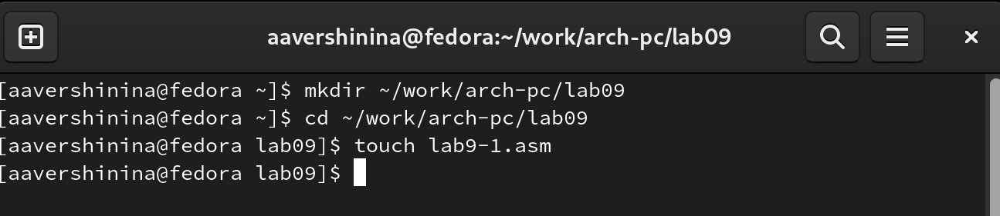{ #fig:001 width=70% }

Введу в файл lab9-1.asm текст программы из листинга 9.1. (рис. [-@fig:002]) Создам исполняемый файл и проверьте его работу. (рис. [-@fig:003])
Данный пример показывает, что использование регистра ecx в теле цилка
loop может привести к некорректной работе программы. 

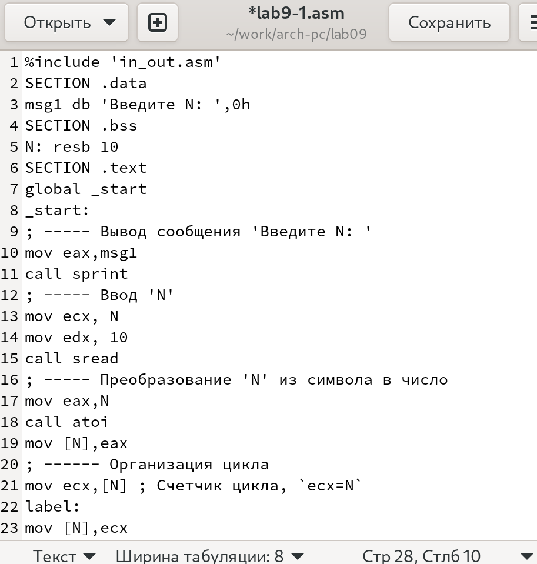{ #fig:002 width=70% }

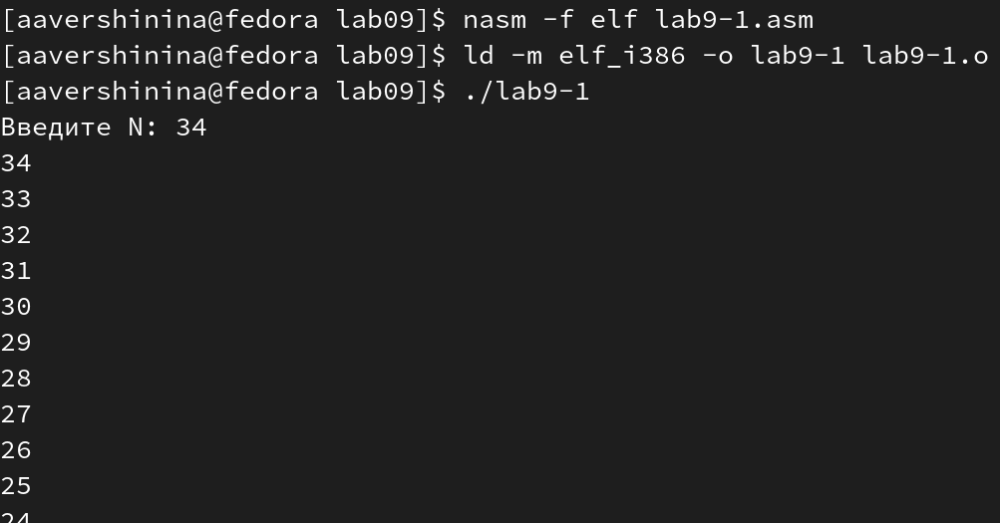{ #fig:003 width=70% }

Изменю текст программы добавив изменение значение регистра ecx в цикле (рис. [-@fig:004])

```nasm
label:
sub ecx,1 ; `ecx=ecx-1`
mov [N],ecx
mov eax,[N]
call iprintLF
loop label
```

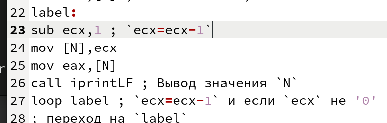{ #fig:004 width=70% }

Создам исполняемый файл и проверьте его работу. (рис. [-@fig:005]) Значения принимаются в результате формулы, число подходов цикла не соответсвует значению, введеному с клавиатуры, значений через одно нет.

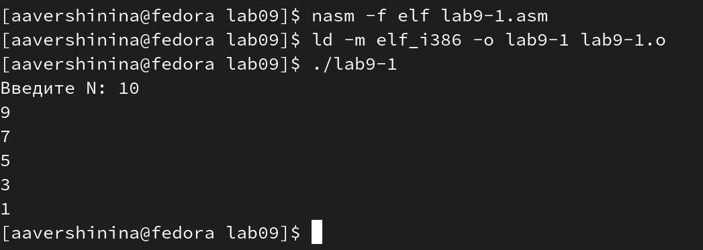{ #fig:005 width=70% }

Для использования регистра ecx в цикле и сохранения корректности работы
программы можно использовать стек. Внесу изменения в текст программы
добавив команды push и pop (добавления в стек и извлечения из стека) для
сохранения значения счетчика цикла loop: (рис. [-@fig:006])

```nasm
label:
push ecx ; добавление значения ecx в стек
sub ecx,1
mov [N],ecx
mov eax,[N]
call iprintLF
pop ecx ; извлечение значения ecx из стека
loop label
```

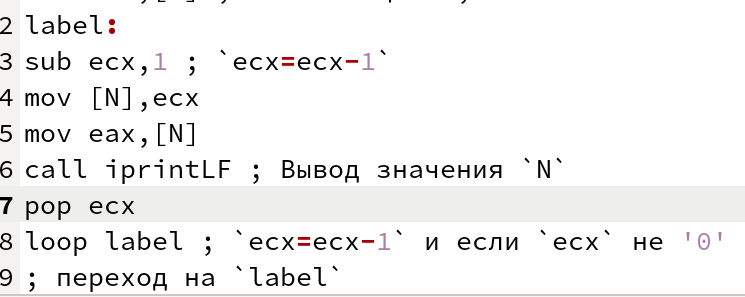{ #fig:006 width=70% }

Создам исполняемый файл и проверьте его работу. (рис. [-@fig:007])

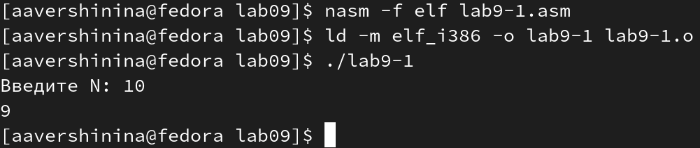{ #fig:007 width=70% }

## Обработка аргументов командной строки

Создам файл lab9-2.asm в каталоге ~/work/arch-pc/lab09 (рис. [-@fig:008]) и введу в него
текст программы из листинга 9.2. (рис. [-@fig:009])

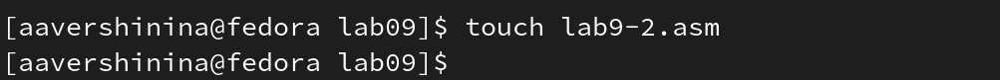{ #fig:008 width=70% }

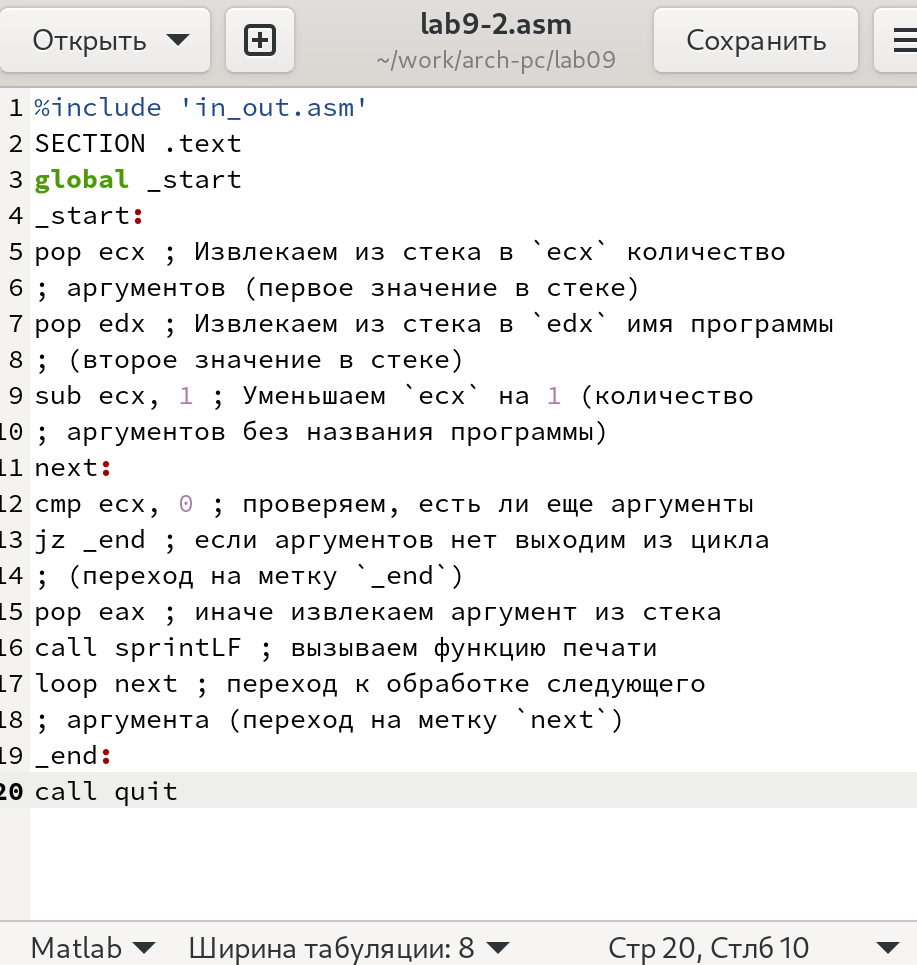{ #fig:009 width=70% }

Создам исполняемый файл и запущу его, указав аргументы: (рис. [-@fig:0010]) обработано 3 из 3 аргументов

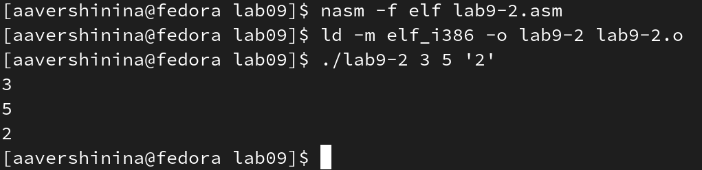{ #fig:0010 width=70% }

Рассмотрим еще один пример программы которая выводит сумму чисел,
которые передаются в программу как аргументы. Создам файл lab9-3.asm в каталоге ~/work/arch-pc/lab09 и введите в него текст программы из листинга
9.3. Создам исполняемый файл и запущу его, указав аргументы: (рис. [-@fig:0011]) Выводится сумма, введеных аргументов

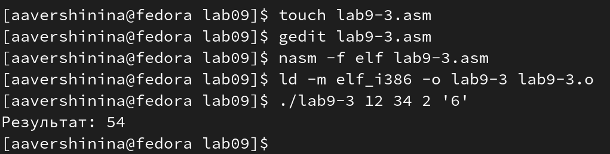{ #fig:0011 width=70% }

Изменю текст программы из листинга 9.3 для вычисления произведения
аргументов командной строки (рис. [-@fig:0012])

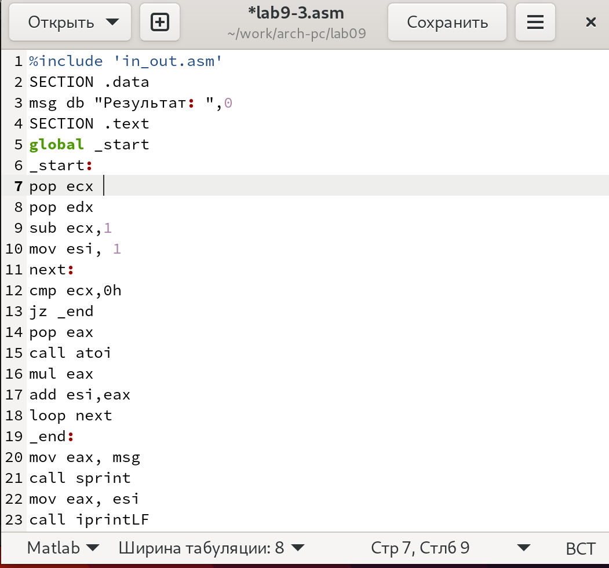{ #fig:0012 width=70% }

Создам исполняемый файл и запущу его, указав аргументы: (рис. [-@fig:0013]) Выводится произведение, введеных аргументов

{ #fig:0013 width=70% }

## Задание для самостоятельной работы

**Задание:** Напишите программу, которая находит сумму значений функции 𝑓(𝑥)
для 𝑥 = 𝑥1, 𝑥2, ..., 𝑥𝑛, т.е. программа должна выводить значение 𝑓(𝑥1) +
𝑓(𝑥2)+...+𝑓(𝑥𝑛). Значения 𝑥𝑖 передаются как аргументы. Вид функции 𝑓(𝑥)
выбрать из таблицы 9.1 вариантов заданий в соответствии с вариантом, по-
лученным при выполнении лабораторной работы No 7.

Создам файл для выполнения задания (рис. [-@fig:0014])

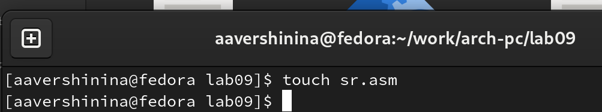{ #fig:0014 width=70% }

Введу программу, которая просуммирует значения, введенные с клавиатуры и после рассчитанные по формуле **F(x) =15x-9** (рис. [-@fig:0015] и [-@fig:0016])

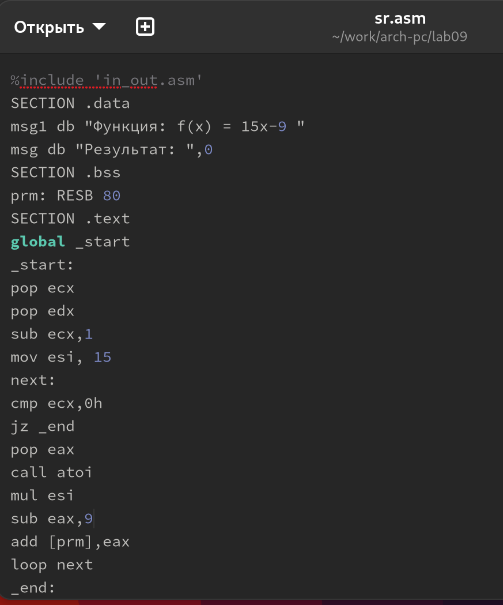{ #fig:0015 width=70% }

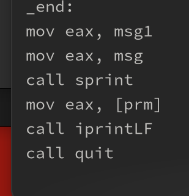{ #fig:0016 width=70% }

Создам исполняемый файл и запущу его, указав аргументы: (рис. [-@fig:0017]) 

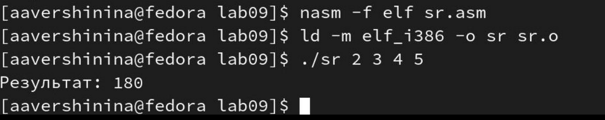{ #fig:0017 width=70% }

# Выводы

В результате выполнения лабораторной работы я приобрела навыки написания программ с использованием циклов и обработкой аргументов командной строки. 

# Список литературы{.unnumbered}

::: {#refs}
:::
