---
## Front matter
title: "Лабораторная работа №10"
subtitle: "Понятие
подпрограммы. Отладчик GDB."
author: "Вершинина Ангелина Алексеевна"

## Generic otions
lang: ru-RU
toc-title: "Содержание"

## Bibliography
bibliography: bib/cite.bib
csl: pandoc/csl/gost-r-7-0-5-2008-numeric.csl

## Pdf output format
toc: true # Table of contents
toc-depth: 2
lof: true # List of figures
lot: true # List of tables
fontsize: 12pt
linestretch: 1.5
papersize: a4
documentclass: scrreprt
## I18n polyglossia
polyglossia-lang:
  name: russian
  options:
	- spelling=modern
	- babelshorthands=true
polyglossia-otherlangs:
  name: english
## I18n babel
babel-lang: russian
babel-otherlangs: english
## Fonts
mainfont: PT Serif
romanfont: PT Serif
sansfont: PT Sans
monofont: PT Mono
mainfontoptions: Ligatures=TeX
romanfontoptions: Ligatures=TeX
sansfontoptions: Ligatures=TeX,Scale=MatchLowercase
monofontoptions: Scale=MatchLowercase,Scale=0.9
## Biblatex
biblatex: true
biblio-style: "gost-numeric"
biblatexoptions:
  - parentracker=true
  - backend=biber
  - hyperref=auto
  - language=auto
  - autolang=other*
  - citestyle=gost-numeric
## Pandoc-crossref LaTeX customization
figureTitle: "Рис."
tableTitle: "Таблица"
listingTitle: "Листинг"
lofTitle: "Список иллюстраций"
lotTitle: "Список таблиц"
lolTitle: "Листинги"
## Misc options
indent: true
header-includes:
  - \usepackage{indentfirst}
  - \usepackage{float} # keep figures where there are in the text
  - \floatplacement{figure}{H} # keep figures where there are in the text
---

# Цель работы

Приобретение навыков написания программ с использованием подпрограмм.
Знакомство с методами отладки при помощи GDB и его основными возможностями.

# Задание

Написание программ с использование подпрограмм и изучение методов отладки

# Теоретическое введение

Отладка — это процесс поиска и исправления ошибок в программе. В общем
случае его можно разделить на четыре этапа:

1. обнаружение ошибки;
2. поиск её местонахождения;
3. определение причины ошибки;
4. исправление ошибки.

Можно выделить следующие типы ошибок:

1. синтаксические ошибки — обнаруживаются во время трансляции исходно-
го кода и вызваны нарушением ожидаемой формы или структуры языка;
2. семантические ошибки — являются логическими и приводят к тому, что
программа запускается, отрабатывает, но не даёт желаемого результата;

# Выполнение лабораторной работы

## Реализация подпрограмм в NASM

Создайте каталог для выполнения лабораторной работы No 10, перейдите
в него и создайте файл lab10-1.asm(рис. [-@fig:001])

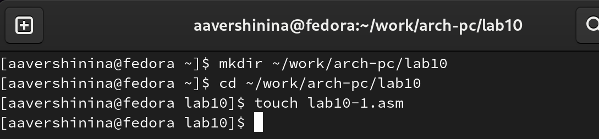{ #fig:001 width=70% }

В качестве примера рассмотрим программу вычисления арифметического
выражения 𝑓(х) = 2х + 7 с помощью подпрограммы _calcul. В данном
примере 𝑥 вводится с клавиатуры, а само выражение вычисляется в под-
программе.

Введите в файл lab10-1.asm текст программы из листинга 10.1.(рис. [-@fig:002]) Создайте
исполняемый файл и проверьте его работу.(рис. [-@fig:003])

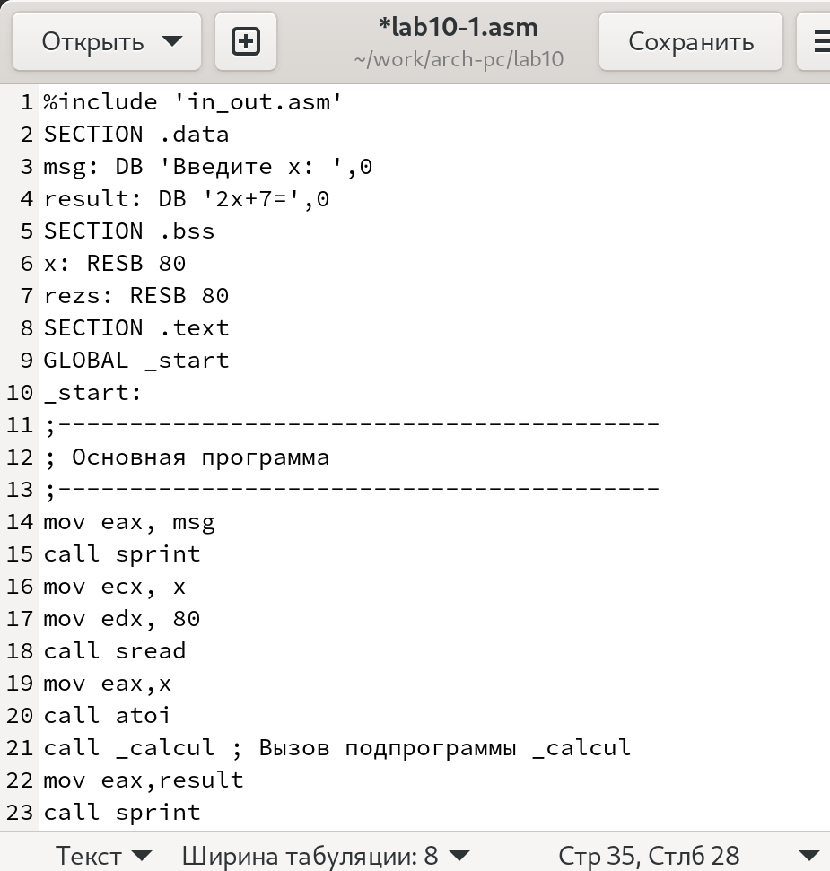{ #fig:002 width=70% }

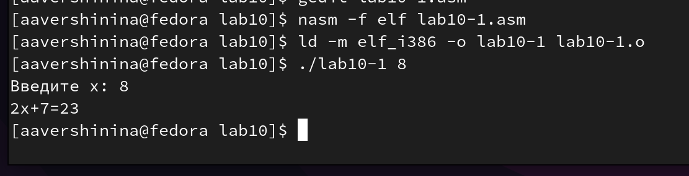{ #fig:003 width=70% }

Измените текст программы, добавив подпрограмму _subcalcul в подпро-
грамму _calcul, для вычисления выражения 𝑓(𝑔(𝑥)), где 𝑥 вводится с клавиату-
ры, 𝑓(х) = 2х + 7, 𝑔(х) = 3х − 1. Т.е. х передается в подпрограмму _calcul из нее
в подпрограмму _subcalcul, где вычисляется выражение 𝑔(𝑥), результат воз-
вращается в _calcul и вычисляется выражение 𝑓(𝑔(𝑥)). Результат возвращается
в основную программу для вывода результата на экран.(рис. [-@fig:004])

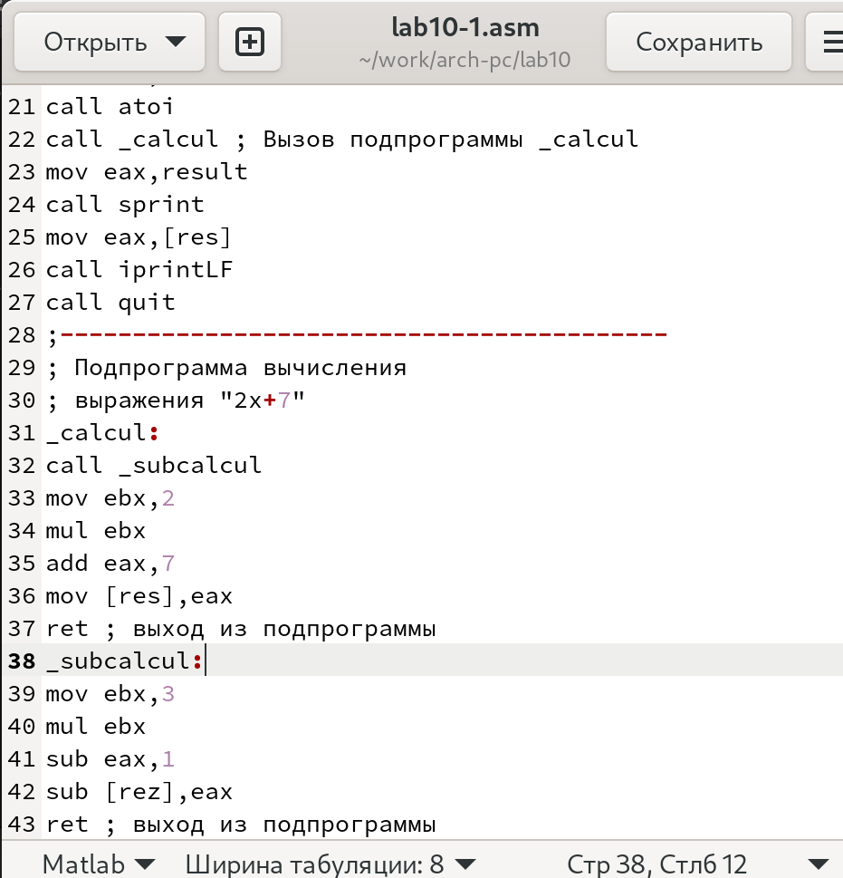{ #fig:004 width=70% }

Создайте
исполняемый файл и проверьте его работу.(рис. [-@fig:005])

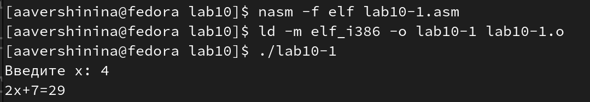{ #fig:005 width=70% }

## Отладка программам с помощью GDB

Создайте файл lab10-2.asm с текстом программы из Листинга 10.2. (Программа печати сообщения Hello world!) (рис. [-@fig:006] и [-@fig:007])

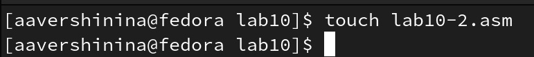{ #fig:006 width=70% }

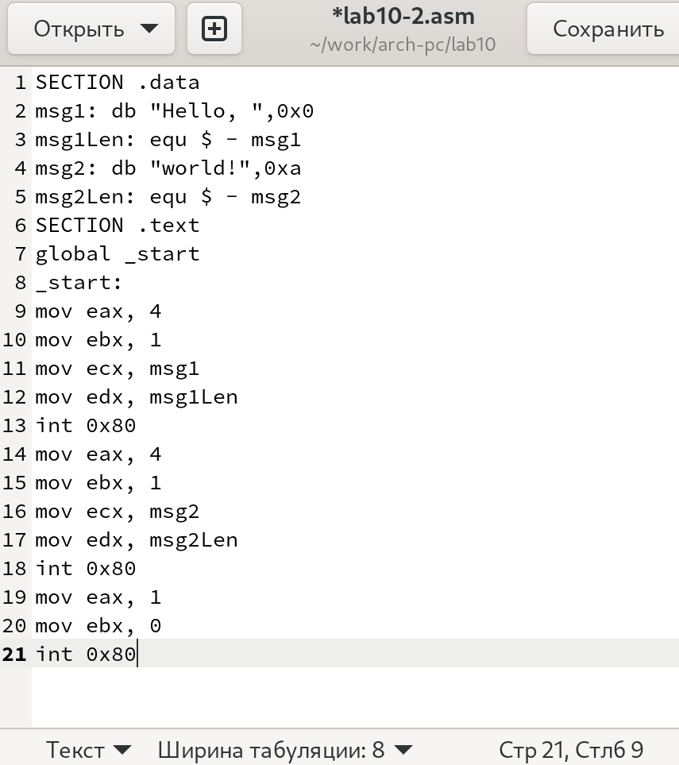{ #fig:007 width=70% }

Получите исполняемый файл. Для работы с GDB в исполняемый файл необходимо добавить отладочную информацию, для этого трансляцию программ
необходимо проводить с ключом ‘-g’. (рис. [-@fig:008])

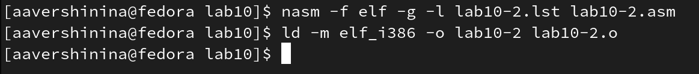{ #fig:008 width=70% }

Загрузите исполняемый файл в отладчик gdb (рис. [-@fig:009])

{ #fig:008 width=70% }

Проверьте работу программы, запустив ее в оболочке GDB с помощью команды run (сокращённо r) (рис. [-@fig:0010])

{ #fig:008 width=70% }

Для более подробного анализа программы установите брейкпоинт на метку
_start, с которой начинается выполнение любой ассемблерной программы, и
запустите её. (рис. [-@fig:0011])

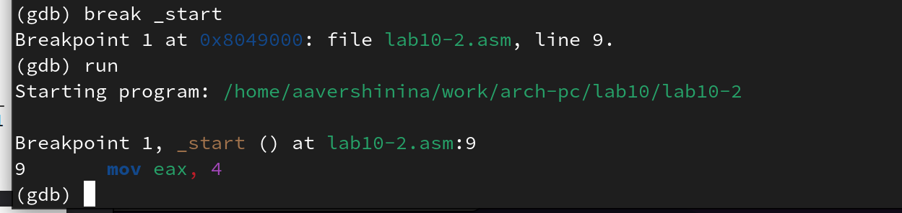{ #fig:0011 width=70% }

Посмотрите дисассимилированный код программы с помощью команды
disassemble начиная с метки _start (рис. [-@fig:0012])

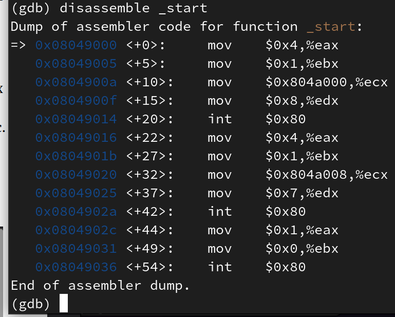{ #fig:0012 width=70% }

Переключитесь на отображение команд с Intel’овским синтаксисом, введя
команду set disassembly-flavor intel (рис. [-@fig:0013])

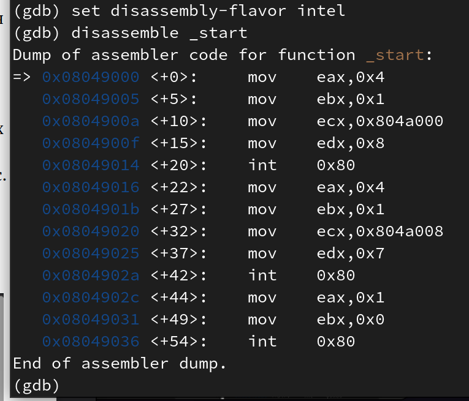{ #fig:0013 width=70% }

Различие синтаксиса заключается  в порядке и формате записи регистров  и действие над ними.

Включите режим псевдографики для более удобного анализа программы (рис. [-@fig:0014] и [-@fig:0015])

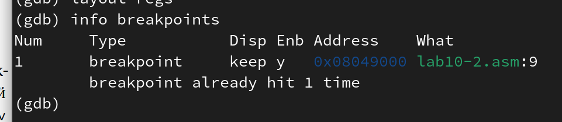{ #fig:0014 width=70% }

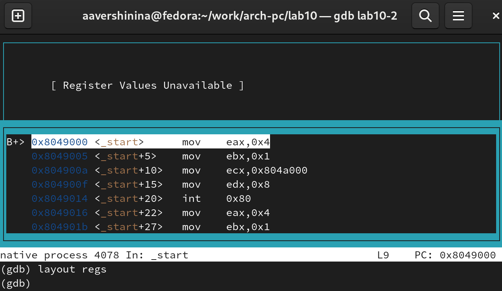{ #fig:0015 width=70% }

На предыдущих шагах была установлена точка останова по имени метки
(_start). Проверьте это с помощью команды info breakpoints (кратко i b) (рис. [-@fig:0016])

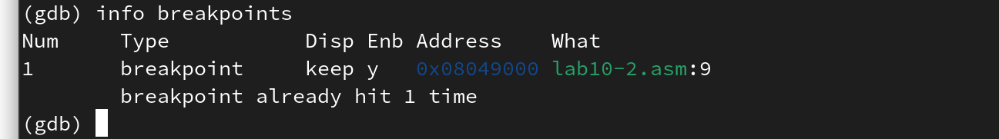{ #fig:0016 width=70% }

Установим еще одну точку останова по адресу инструкции. Адрес инструкции можно увидеть в средней части экрана в левом столбце соответствующей
инструкции. Определите адрес предпоследней инструкции (mov
ebx,0x0) и установите точку останова (рис. [-@fig:0017])

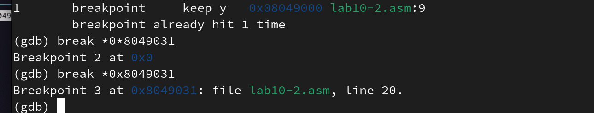{ #fig:0017 width=70% }

Посмотрите информацию о всех установленных точках останова (рис. [-@fig:0018])

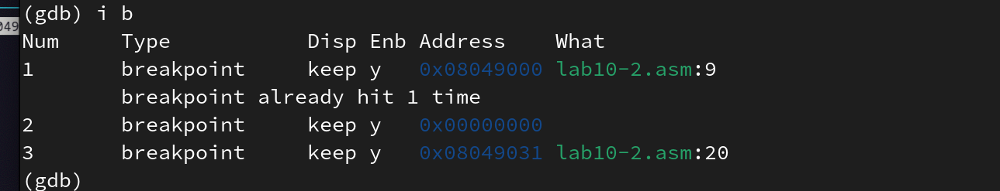{ #fig:0018 width=70% }

Посмотреть содержимое регистров также можно с помощью команды info
registers (или i r) (рис. [-@fig:0019])

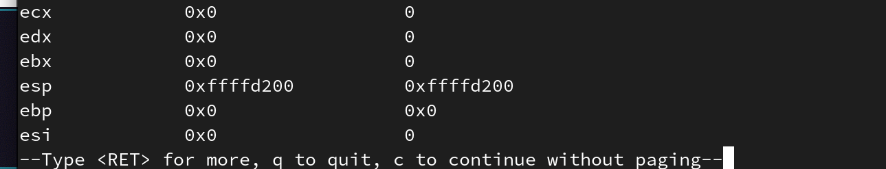{ #fig:0019 width=70% }

Для отображения содержимого памяти можно использовать команду x
<адрес>, которая выдаёт содержимое ячейки памяти по указанному адресу.

Формат, в котором выводятся данные, можно задать после имени команды
через косую черту: x/NFU <адрес>.

С помощью команды x &<имя переменной> также можно посмотреть содер-
жимое переменной.

Посмотрите значение переменной msg1 по имени (рис. [-@fig:0020])

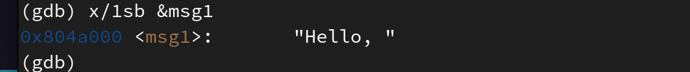{ #fig:0020 width=70% }

Посмотрите значение переменной msg2 по адресу. Адрес переменной можно
определить по дизассемблированной инструкции. Посмотрите инструкцию mov
ecx,msg2 которая записывает в регистр ecx адрес перемененной msg2 (рис. [-@fig:0021])

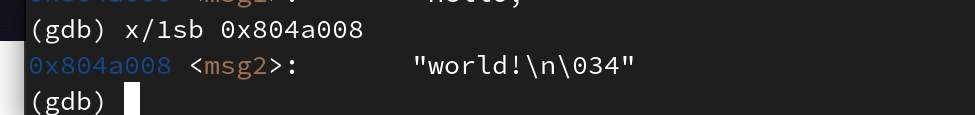{ #fig:0021 width=70% }

Изменить значение для регистра или ячейки памяти можно с помощью ко-
манды set, задав ей в качестве аргумента имя регистра или адрес. При этом
перед именем регистра ставится префикс $, а перед адресом нужно указать
в фигурных скобках тип данных (размер сохраняемого значения; в качестве
типа данных можно использовать типы языка Си). Измените первый символ
переменной msg1  (рис. [-@fig:0022]) второй символ (рис. [-@fig:0023])

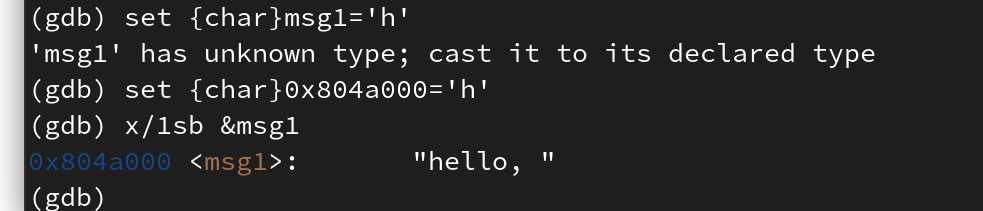{ #fig:0022 width=70% }

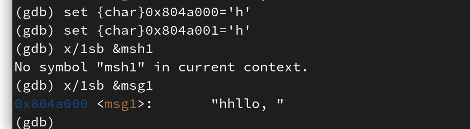{ #fig:0023 width=70% }

Замените любой символ во второй переменной msg2 (рис. [-@fig:0024])

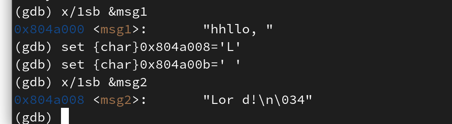{ #fig:0024 width=70% }

Чтобы посмотреть значения регистров используется команда print /F <val>
(перед именем регистра обязательно ставится префикс $) (рис. [-@fig:0025])

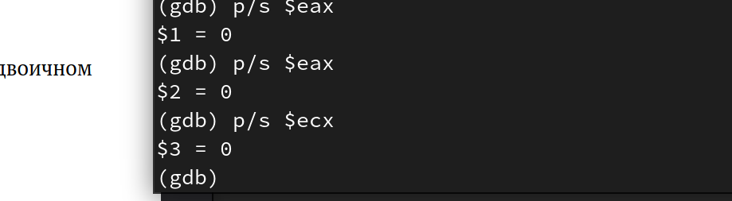{ #fig:0025 width=70% }

С помощью команды set измените значение регистра ebx (рис. [-@fig:0026] и [-@fig:0027]) разница заключается в том. что вводят число и символ. а символ переводится в число согласно таблице.

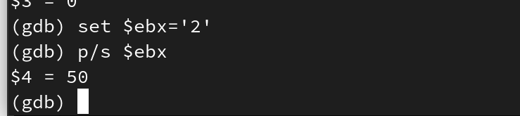{ #fig:0026 width=70% }

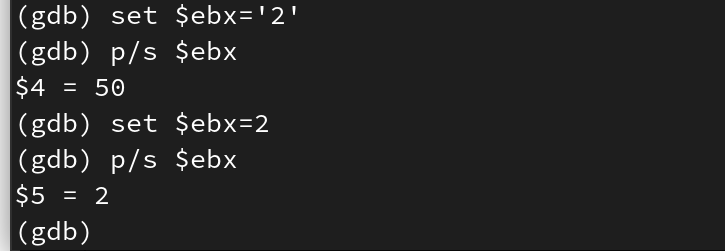{ #fig:0027 width=70% }

Завершите выполнение программы с помощью команды continue (сокра-
щенно c) или stepi (сокращенно si) и выйдите из GDB с помощью команды
quit (сокращенно q).

Скопируйте файл lab9-2.asm, созданный при выполнении лабораторной ра-
боты No9, с программой выводящей на экран аргументы командной строки
(Листинг 9.2) в файл с именем lab10-3.asm (рис. [-@fig:0028])

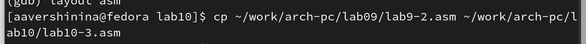{ #fig:0028 width=70% }

Создайте исполняемый файл. Для загрузки в gdb программы с аргументами необходимо использовать ключ
--args. Загрузите исполняемый файл в отладчик, указав аргументы (рис. [-@fig:0029])

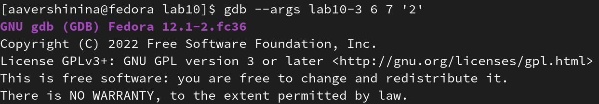{ #fig:0029 width=70% }

Для начала установим точку останова перед первой инструкцией в программе
и запустим ее. (рис. [-@fig:0030])

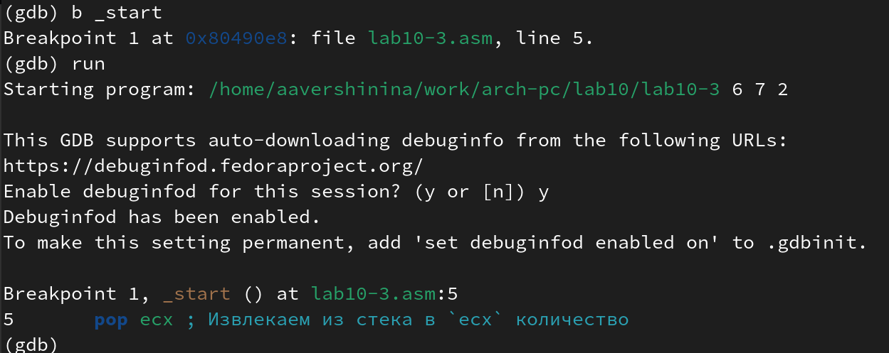{ #fig:0030 width=70% }

Адрес вершины стека храниться в регистре esp и по этому адресу располагается число равное количеству аргументов командной строки (включая имя
программы (рис. [-@fig:0031])

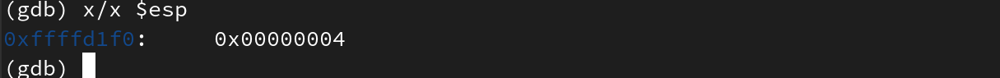{ #fig:0031 width=70% }

Посмотрите остальные позиции стека – по адесу [esp+4] располагается адрес
в памяти где находиться имя программы, по адесу [esp+8] храниться адрес
первого аргумента, по аресу [esp+12] – второго и т.д. (рис. [-@fig:0032]) Шаг равен 4 из-за количества аргументов и количества операций, выполняемых с ними

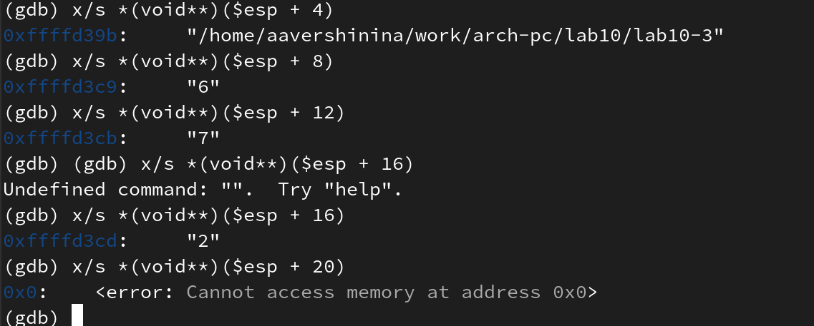{ #fig:0032 width=70% }

## Задания для самостоятельной работы

1. Преобразуйте программу из лабораторной работы No9 (Задание No1 для
самостоятельной работы), реализовав вычисление значения функции 𝑓(𝑥)
как подпрограмму.

Открою файл программы lab9-2.asm и изменю текст программы с использование подпрограммы для вычисления функции (рис. [-@fig:0033] и [-@fig:0034])

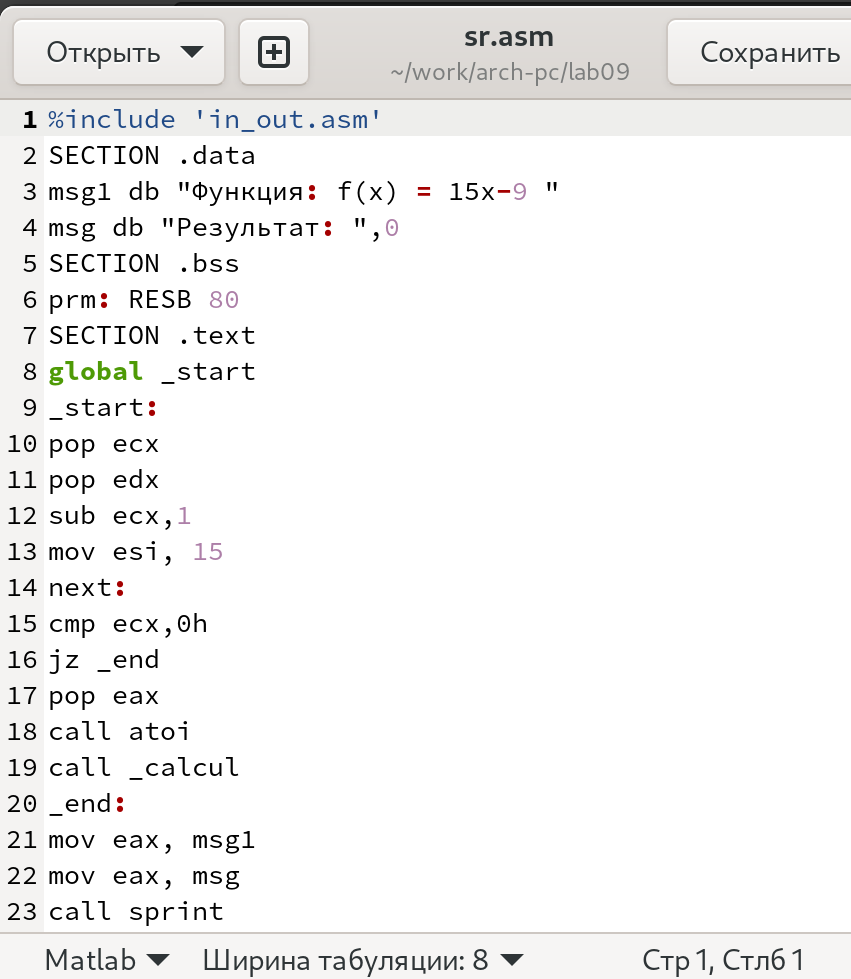{ #fig:0033 width=70% }

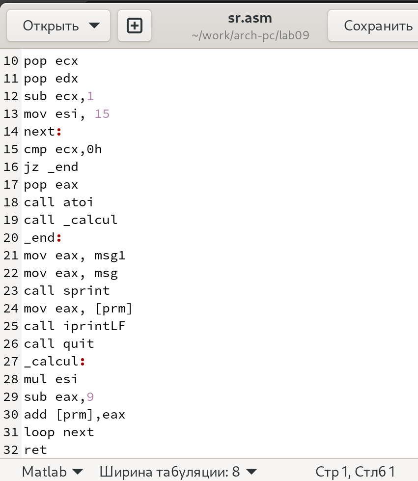{ #fig:0034 width=70% }

Создам исполняемый файл и проверю его работу (рис. [-@fig:0035])

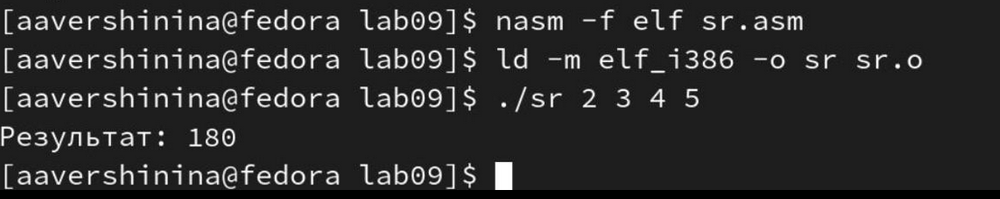{ #fig:0035 width=70% }

2. В листинге 10.3 приведена программа вычисления выражения (3 + 2) ∗ 4 + 5.
При запуске данная программа дает неверный результат. Проверьте это.
С помощью отладчика GDB, анализируя изменения значений регистров,
определите ошибку и исправьте ее

Создам файл sr2.asm и вставлю текст листинга 10.2 (рис. [-@fig:0036])

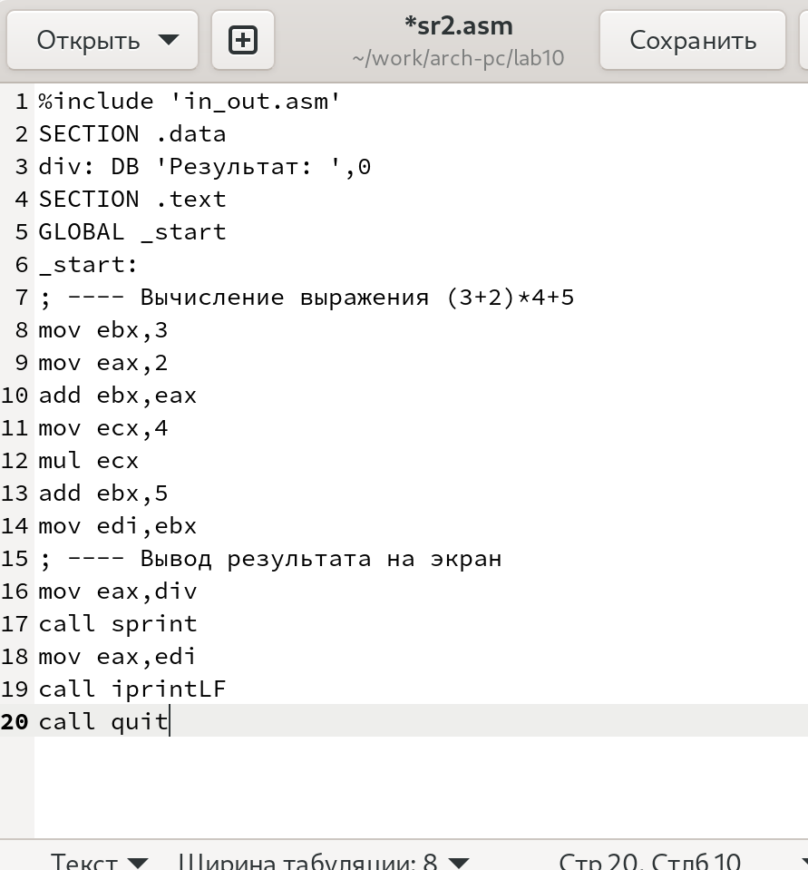{ #fig:0036 width=70% }

Создам исполняемый файл и проверю его работу (рис. [-@fig:0037]) Результат 10 -неверно

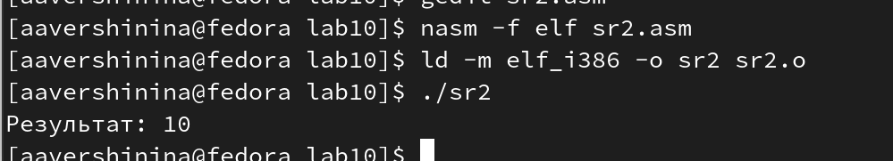{ #fig:0037 width=70% }

Создам исполняемый файл и перейду в отладчик для анализа (рис. [-@fig:0038] и [-@fig:0039] и [-@fig:0040])ю поиск ошибки показал, что неправильно использован порядок регистров и их размерность.

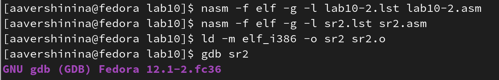{ #fig:0038 width=70% }

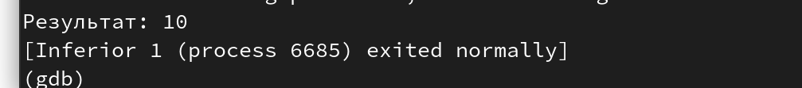{ #fig:0039 width=70% }

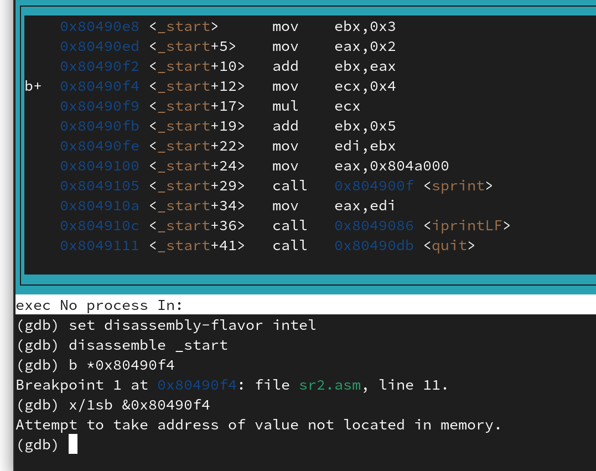{ #fig:0040 width=70% }

Внесу изменения в текст программы для корректной работы  (рис. [-@fig:0041])

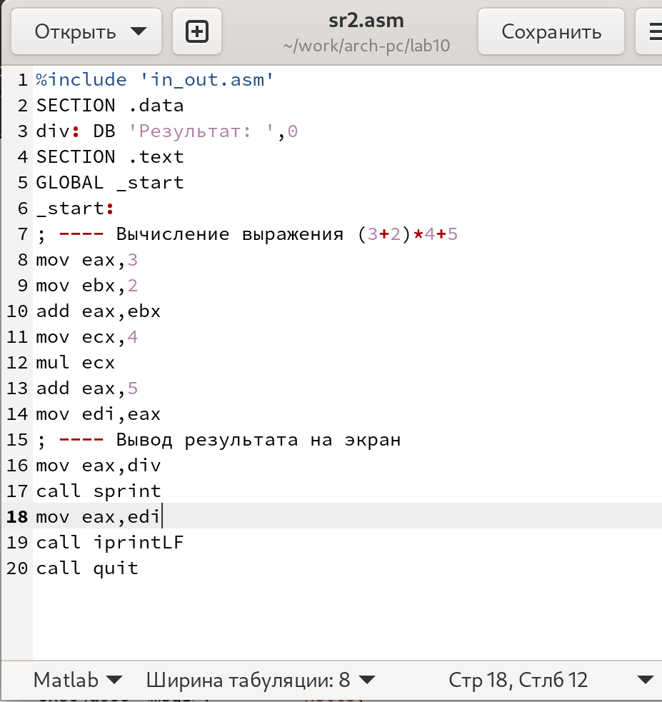{ #fig:0041 width=70% }

Создам исполняемый файл и проверю его работу (рис. [-@fig:0042]) результат 25 - верно.

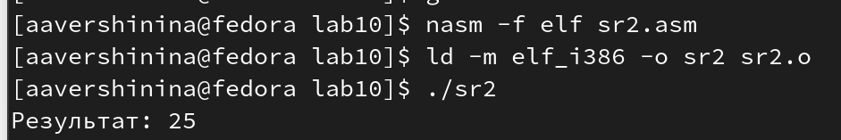{ #fig:0042 width=70% }

# Выводы

В результате выполнения лабораторной работы я приобрела навыки написания программ с использованием подпрограмм.
Познакомилась с методами отладки при помощи GDB и его основными возможностями.

# Список литературы{.unnumbered}

::: {#refs}
:::
