---
## Front matter
title: "Лабораторная работа №11"
subtitle: "Работа с
файлами средствами Nasm"
author: "Вершинина Ангелина Алексеевна"

## Generic otions
lang: ru-RU
toc-title: "Содержание"

## Bibliography
bibliography: bib/cite.bib
csl: pandoc/csl/gost-r-7-0-5-2008-numeric.csl

## Pdf output format
toc: true # Table of contents
toc-depth: 2
lof: true # List of figures
lot: true # List of tables
fontsize: 12pt
linestretch: 1.5
papersize: a4
documentclass: scrreprt
## I18n polyglossia
polyglossia-lang:
  name: russian
  options:
	- spelling=modern
	- babelshorthands=true
polyglossia-otherlangs:
  name: english
## I18n babel
babel-lang: russian
babel-otherlangs: english
## Fonts
mainfont: PT Serif
romanfont: PT Serif
sansfont: PT Sans
monofont: PT Mono
mainfontoptions: Ligatures=TeX
romanfontoptions: Ligatures=TeX
sansfontoptions: Ligatures=TeX,Scale=MatchLowercase
monofontoptions: Scale=MatchLowercase,Scale=0.9
## Biblatex
biblatex: true
biblio-style: "gost-numeric"
biblatexoptions:
  - parentracker=true
  - backend=biber
  - hyperref=auto
  - language=auto
  - autolang=other*
  - citestyle=gost-numeric
## Pandoc-crossref LaTeX customization
figureTitle: "Рис."
tableTitle: "Таблица"
listingTitle: "Листинг"
lofTitle: "Список иллюстраций"
lotTitle: "Список таблиц"
lolTitle: "Листинги"
## Misc options
indent: true
header-includes:
  - \usepackage{indentfirst}
  - \usepackage{float} # keep figures where there are in the text
  - \floatplacement{figure}{H} # keep figures where there are in the text
---

# Цель работы

Приобретение навыков написания программ для работы с файлами

# Задание

Написать программы, которые работают с файлами

# Теоретическое введение

ОС GNU/Linux является многопользовательской операционной системой. И
для обеспечения защиты данных одного пользователя от действий других поль-
зователей существуют специальные механизмы разграничения доступа к фай-
лам. Кроме ограничения доступа, данный механизм позволяет разрешить дру-
гим пользователям доступ данным для совместной работы.
Права доступа определяют набор действий (чтение, запись, выполнение), раз-
решённых для выполнения пользователям системы над файлами. Для каждого
файла пользователь может входить в одну из трех групп: владелец, член группы
владельца, все остальные. Для каждой из этих групп может быть установлен свой
набор прав доступа. Владельцем файла является его создатель.

# Выполнение лабораторной работы

Создам каталог для программ лабораторной работы №11, перейду
в него и создам файл lab11-1.asm и readme.txt:(рис. [-@fig:001])

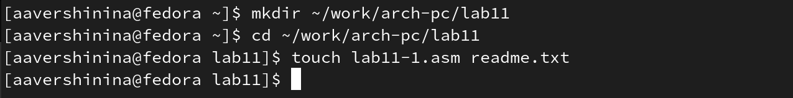{ #fig:001 width=70% }

Введу в файл lab11-1.asm текст программы из листинга 11.1 (Программа
записи в файл сообщения) (рис. [-@fig:002])

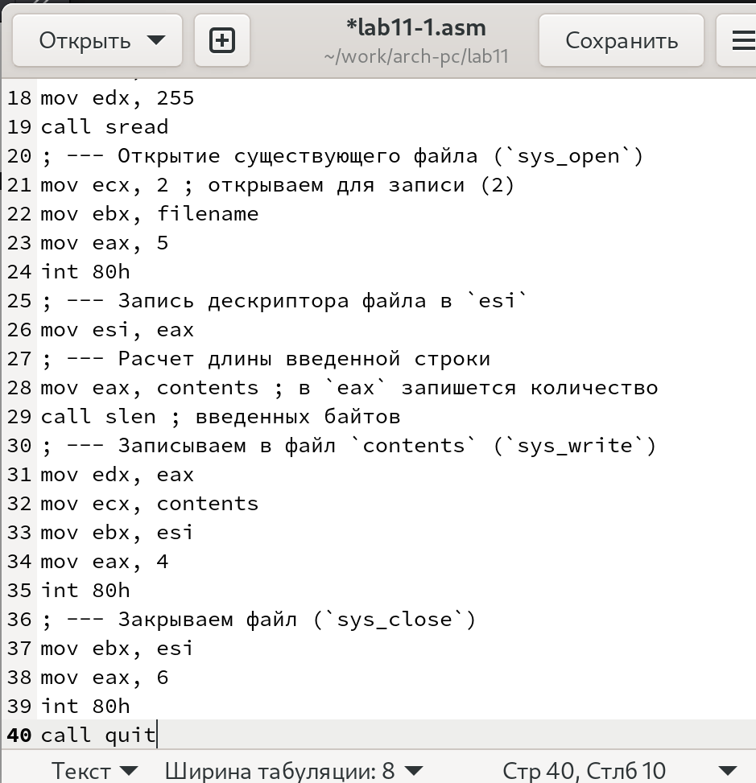{ #fig:002 width=70% }

Создам исполняемый файл и проверю его работу. (рис. [-@fig:003], [-@fig:004], [-@fig:005] и [-@fig:006])В результате строка записывается в файл.

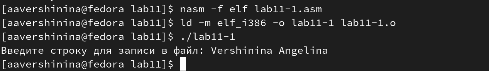{ #fig:003 width=70% }

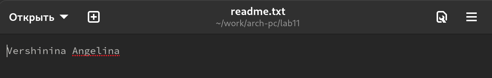{ #fig:004 width=70% }

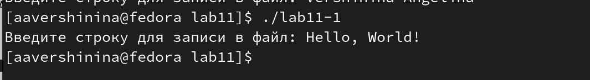{ #fig:005 width=70% }

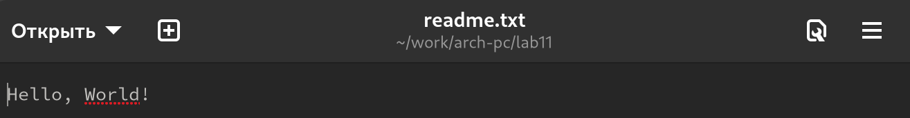{ #fig:006 width=70% }


С помощью команды chmod изменю права доступа к исполняемому файлу
lab11-1, запретив его выполнение. (рис. [-@fig:007])Попытаюсь выполнить файл. Не удалось выполнить файл из-за запрета в доступе.

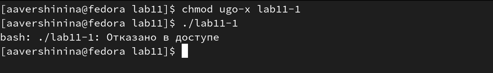{ #fig:007 width=70% }

С помощью команды chmod изменю права доступа к файлу lab11-1.asm с
исходным текстом программы, добавив права на исполнение. Попытаюсь
выполнить его (рис. [-@fig:008]) Ошибка вызвана вызовом не исполняемого файла

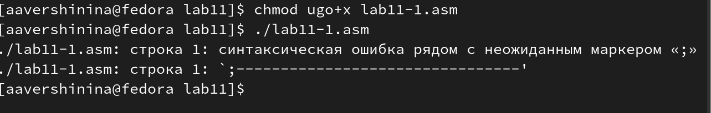{ #fig:008 width=70% }

Предоставлю права доступа к файлу readme.txt в соответствии с вариантом в таблице 11.4(ранее полученный вариант - 12). --x -wx r-x. Проверю правильность выполнения с помощью команды ls -l (рис. [-@fig:009])

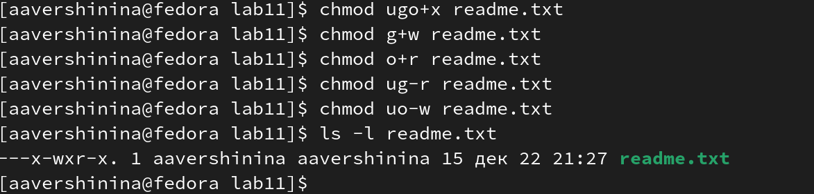{ #fig:009 width=70% }

## Задание для самостоятельной работы

**Задание**

```
Напишите программу работающую по следующему алгоритму:
• Вывод приглашения “Как Вас зовут?”
• ввести с клавиатуры свои фамилию и имя
• создать файл с именем name.txt
• записать в файл сообщение “Меня зовут”
• дописать в файл строку введенную с клавиатуры
• закрыть файл
Создать исполняемый файл и проверить его работу. Проверить наличие файла
и его содержимое с помощью команд ls и cat
```
Введу текст программы в файл sr.asm (рис. [-@fig:0010] и [-@fig:0011])

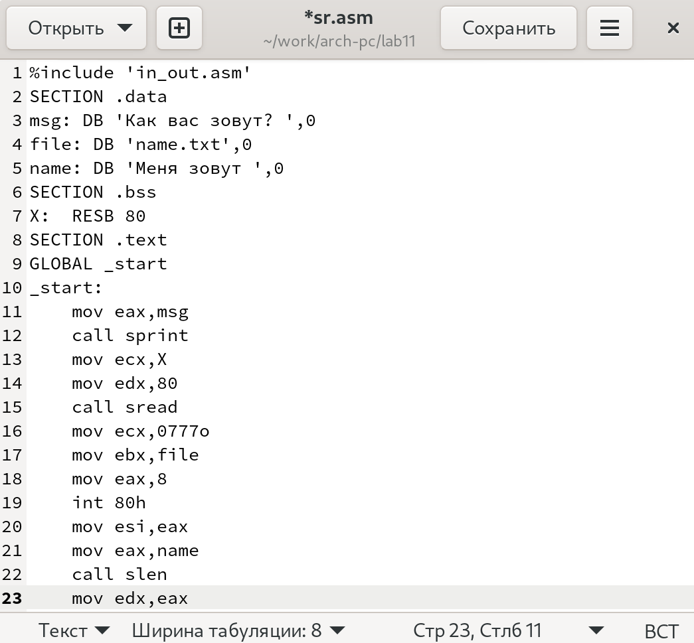{ #fig:0010 width=70% }

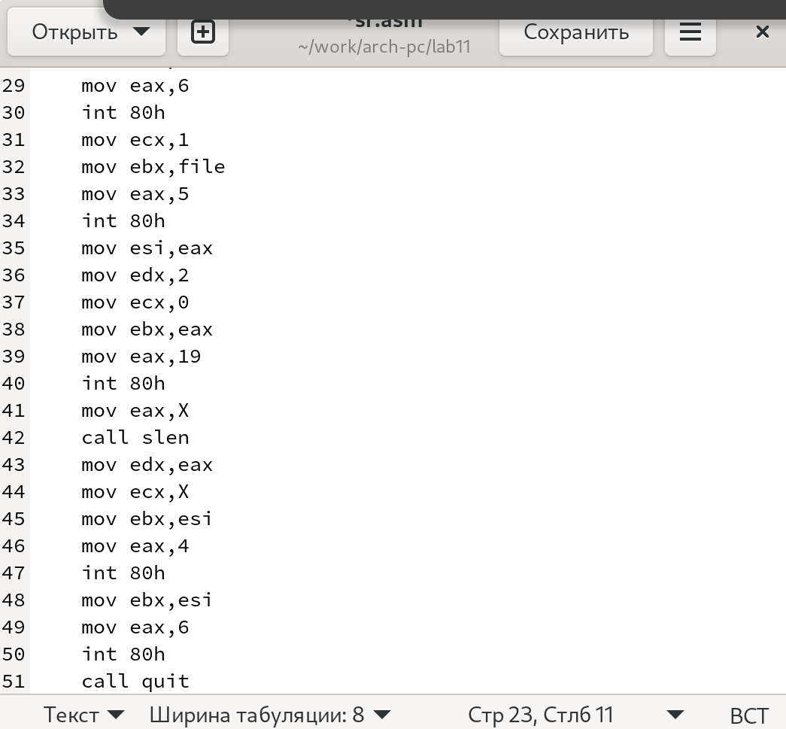{ #fig:0011 width=70% }

Создам исполняемый файл и проверю работу программы. Введу Фамилию и имя(рис. [-@fig:0012])

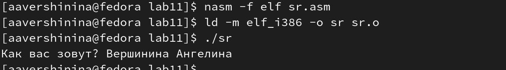{ #fig:0012 width=70% }

Проверю наличие файла (ls -l)(рис. [-@fig:0013]) и его содержимое(cat). (рис. [-@fig:0014])

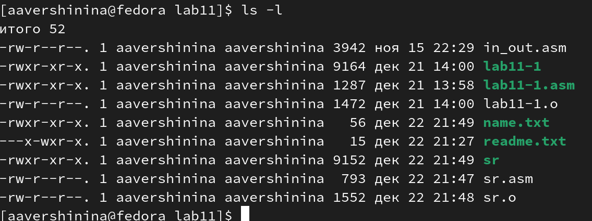{ #fig:0013 width=70% }

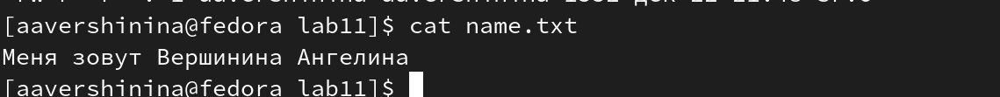{ #fig:0014 width=70% }

# Выводы

В результате выполнения лабораторной работы я приобрела навыки написания программ для работы с файлами

# Список литературы{.unnumbered}

::: {#refs}
:::
